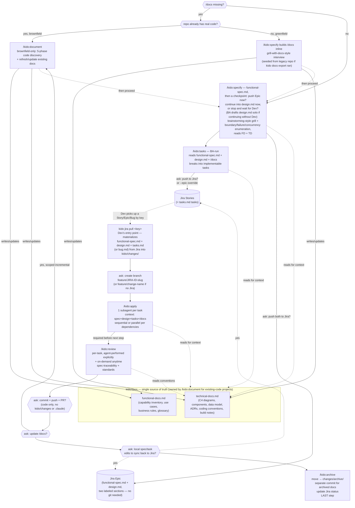

# Kido — Design

## Context

Kido is a spec-driven collaboration workflow for a team, inspired by two references:
- **OpenSpec**: a spec-driven change pipeline — proposal → design → tasks → apply → archive — with an explore mode for pre-formalization thinking.
- **mattpocock/skills**: a curated library of independent team disciplines (tdd, code-review, grill-me, ...) distributed via an npm installer or Claude Code plugin.

Two roles collaborate through AI agents on a shared unit of work:
- **BA**: writes functional specs, breaks them into Jira Epics/Stories.
- **Dev**: writes technical specs, implements, and code-reviews.

The system works across **greenfield** (nothing exists yet) and **brownfield** (existing codebase/specs to reconcile with) projects, one microservice repo at a time, and is packaged/distributed as an installable npm CLI rather than used ad hoc.

For the full chronological reasoning behind every choice below — every question asked, every correction made, all 61 numbered decisions — see [`docs/DECISION_LOG.md`](docs/DECISION_LOG.md). This file only covers what Kido *is* and how it works today.

---

# Status as of implementation

The CLI is built and working (`C:\Solutions\Kido`, npm package `kido`, symlink-installed via `npm link`, verified against a real brownfield repo at `D:\HedgeR`). 39 automated tests passing. The design below reflects the **current** state — corrections made after real usage are folded directly into the relevant sections rather than kept as a separate patch list, except for the two items below that are still genuinely open.

## Known open gap, not yet resolved

**PR-merge timing race**: if the code-commit PR (`/kido:archive` step 1) merges before the archive-docs commit (step 3) gets pushed, pushing to the same feature branch is risky — many teams auto-delete branches after merge, so the push could fail or land an orphaned commit outside the merged PR. Two candidate fixes were identified but not decided:
- (a) Reorder so the docs/archive commits happen *before* the code push, so everything lands in one PR with a single push. Simpler, but means "archived"/Jira-done reflects "submitted," not "actually merged."
- (b) Detect merge state at archive time and, if already merged, commit directly to main instead of the feature branch. More accurate, bigger workflow change — archive can no longer auto-chain right after commit/push in one session.

## Reference artifact

A visual walkthrough of all 9 pipeline stages (`kido init` → study → spec ×2 → tasks → branch → apply → review → archive) with real example output at each step, using a "Swap Pricing" feature on a brownfield `pricing-service` as the running example: https://claude.ai/code/artifact/04e2e4b9-d268-4ff2-bb41-ce45a610fccb

---

# Product design

## Name & positioning

**Kido** — a standalone, npm-distributed CLI + set of generated Claude Code skills/commands for spec-driven BA/Dev collaboration, covering both greenfield and brownfield (including cross-repo rewrite) projects, one microservice repo at a time. Independent of `openspec` (avoids external-tool dependency) and independent of any third-party skill library (patterns adapted, not depended on).

## Package & build

- npm package `kido`, **TypeScript**, bundled at build time (esbuild) to a single compiled output (`dist/cli.js`) — published `package.json` ships with an **empty runtime `dependencies`** array. devDependencies (TypeScript, esbuild) never ship to consumers.
- CLI binary: `kido`, exposed via `package.json`'s `bin` field. `kido --version` reads a version baked in at build time (no runtime `package.json` lookup — unreliable across install layouts).
- v1 targets **Claude Code only** for generated skills/commands, but the internal pipeline definition (`src/pipeline/definition.ts`) stays agent-agnostic (`{name, description, prompt body, required tools, args}` per stage) behind a renderer interface (`src/pipeline/renderers/`), so Gemini CLI/Kilo Code support can be added later as new renderers without touching the core.
- Jira REST calls via built-in `fetch`, no SDK.
- Jira credentials: user-scoped env vars primary, gitignored `.kido-credentials` file fallback. `kido init` offers to set this up on first run if neither is already configured — writes the file directly, or prints env-var instructions, per the user's choice. Token entry is plaintext.

## Repo-side file layout (what `kido init` creates)

```
<microservice-repo>/
├── kido/
│   ├── docs/
│   │   ├── {project}-functional-docs.md      # BA-facing: capabilities, use cases, business rules, glossary
│   │   └── {project}-technical-docs.md       # Dev-facing: C4 diagrams, components, data model, ADRs, conventions
│   └── changes/
│       ├── <change-name>/                    # kebab-case, one per feature/bug in flight
│       │   ├── functional-spec.md            # feature path only
│       │   ├── design.md                     # feature path only
│       │   ├── tasks.md                      # feature path only
│       │   └── bug.md                        # bug path only (mutually exclusive with the three above)
│       └── archive/
│           └── <change-name>/                # moved here by /kido:archive, same shape as above
└── .claude/
    ├── skills/mr-*/SKILL.md                  # generated, orchestration logic (auto-invokable by the model)
    └── commands/kido/*.md                    # generated, explicit invocation (/kido:*)
```

`kido/changes/` (once archived) is meant to be committed to git — it's the durable, shared record of why the codebase looks the way it does, the whole point of the tool. `.claude/` stays untracked; it's fully regeneratable via `kido init`, nothing is lost by not committing it.

**Why skills are `mr-*` and not `kido-*`**: Claude Code's `/` picker lists skills by their own folder name alongside commands. If both shared the "kido" prefix, typing `/kido` would surface both the skill (`kido-spec`) and the command (`kido:spec`) for every stage — 12 near-duplicate-looking entries for 6 stages. Commands stay `/kido:*`; only the skill folder prefix changed, to `mr-*`. Mirrors openspec's own `openspec-explore` (skill) / `opsx:explore` (command) split — no shared prefix, no collision.

## CLI subcommands (thin, data-ops only — skills hold all orchestration logic)

| Command | Behavior |
|---|---|
| `kido init [--from-legacy <path> \| --no-legacy] [--skip-jira-setup]` | Scaffolds `kido/docs/` + `kido/changes/` + generates `.claude/skills/mr-*` and `.claude/commands/kido/*`. If `/docs` is empty: asks whether to seed from a legacy repo, or flags that `/kido:specify` should run next (builds docs + spec together for greenfield; `/kido:document` if this repo already has real code). If Jira isn't already configured: offers to set it up (file or env vars). Both questions are skipped automatically if already answered/configured — never re-asked needlessly. |
| `kido new-change <name> [--type feature\|bug]` | Scaffolds `kido/changes/<name>/` with the right starter files for the chosen type. |
| `kido status --change <name>` | Reports which artifacts exist/are complete for a change. |
| `kido validate --change <name>` | Checks required artifacts are present/well-formed before archiving. |
| `kido archive <name> [--force]` | Moves `kido/changes/<name>/` → `kido/changes/archive/<name>/`. |
| `kido jira sync --change <name> [--epic <KEY>]` | Pushes `functional-spec.md` + `design.md` (combined into one Epic description, two labeled sections) / `tasks.md` / `bug.md` content to Jira (Epic/Story/Bug); stores returned IDs back into frontmatter; idempotent (create-or-update by stored ID). `--epic` pins Stories to an existing Epic, overriding whatever `functional-spec.md` would auto-create — needed for Dev-only changes (no `functional-spec.md`) or attaching to an Epic that predates Kido adoption. |
| `kido jira pull <key> [--as <change-name>]` | The reverse of `kido jira sync` — given any Jira key, materializes the whole local change into `kido/changes/<name>/`. What comes back depends on the key: a Kido-created Epic (or one of its task Stories) resolves to `functional-spec.md` + `design.md` + `tasks.md` (reconstructed from every child Story); a **small-feature Story** (self-contained — its own description already has the functional-spec/design shape, detected before any parent walk) resolves to just `functional-spec.md` (+ `design.md` if written), no `tasks.md`; a Bug resolves to `bug.md` alone. This is how Dev picks up work BA pushed to Jira but never had repo push access to commit. |
| `kido docs export --to <path>` | Copies `kido/docs/*` into another repo — the literal-copy half of the cross-repo seeding flow. `/kido:specify` (not `/kido:document`) is what re-runs seeded with the copy, since the target repo is greenfield relative to docs. |

## Generated skills/commands (orchestration logic)

| Command | Behavior |
|---|---|
| `/kido:document` | Brownfield-only — the user's existing `discover-and-document` skill, adapted as-is (5-phase: Inventory → Map → Deep-dive → Synthesize → Emit; every claim grounded in a real file/symbol, gaps flagged as open questions). Also the command to refresh existing `/docs` — repeatable/incremental at any time, including scoped per-change updates triggered from `/kido:archive`. For a project with no code yet, this isn't the right command — see `/kido:specify`. Owns `/docs` exclusively for existing-code projects — every other stage reads it, none write to it directly. |
| `/kido:specify` | First fork: **"bug or feature?"**. If `/docs` is missing: redirects to `/kido:document` first when the repo already has real code (brownfield); otherwise builds `/docs` itself inline, adapting the `grill-with-docs`-style interview (vision → capabilities → architecture → conventions, ADRs drafted live, hybrid termination — including the seeded-from-legacy-repo case via `kido docs export`), before continuing into the fork. **Feature**: functional-spec grilling first; once `functional-spec.md` is written, an explicit **checkpoint** — asks to push it to Jira, and if so, **new Epic or existing Epic?** New Epic is the default (functional-spec.md + design.md become their own Epic). Existing Epic means this is a small, single-unit feature: it syncs as one **Story** nested under an Epic BA already has (`epicId` frontmatter) instead — and skips `/kido:tasks` entirely, since there's no task breakdown; only pick it when the feature won't need multiple tasks (task breakdown under a shared existing Epic isn't supported yet — use "new Epic" if unsure). Either way, the checkpoint then asks whether to continue into design grilling now or stop and pick it up later with Dev. If continuing and Dev isn't present, the agent drafts `design.md` itself (flagged for later async validation, non-blocking) rather than blocking, since BA has no git push access and Jira, not git, is how the result reaches Dev. Both passes use Superpowers-`brainstorming`-style grilling: one question at a time, 2-3 approaches with tradeoffs, section-by-section approval, self-review — plus a required boundary/failure/concurrent-access enumeration before a section counts as done. Once `design.md` is also written, the Epic/Story gets synced again (update, not duplicate) if it wasn't already, or the push is asked for the first time if it was declined at the checkpoint. Dev-only entry (starting directly at `design.md`, no `functional-spec.md` at all) is reserved for genuinely non-business-facing internal/infra work — NOT for anything with functional impact, including migrations, which route through BA regardless of whether the change is "just" a rewrite. **Bug**: produces `bug.md` (description + reproduction scenario if known) — same grilling rigor and boundary/failure/concurrent-access enumeration as the functional-spec pass, still no design.md/tasks.md split. |
| `/kido:tasks` | Feature-path only, BA-run, and only reached when `/kido:specify` used "new Epic" mode — "existing Epic" mode never gets here. Reads `functional-spec.md` + `design.md` + `/docs`. Breaks work into vertical-slice, tracer-bullet tasks (schema/API/UI/tests together, independently completable/demonstrable) with dependency ordering. Before Jira sync, resolves the Epic: auto from `functional-spec.md` if present, else asks whether an existing Epic should be used (`--epic`). Each task syncs as its own Jira Story. No branch creation here — BA has no push access, so that moves to `/kido:apply`, run by whoever will actually push. |
| `/kido:apply` | Dev's entry point. Accepts a local change name **or a Jira key** (Epic/Story/Bug) — if given a key and the local folder doesn't exist yet, runs `kido jira pull <key>` first to materialize it. Then **asks to create the branch** (`feature/<JIRA-ID>-<slug>` if a Jira ID is known, `feature/<change-name>` fallback otherwise) before anything else. Feature path: one subagent per task, context bundle = `functional-spec.md` + `design.md` + this task + `/docs`. Sequential where `tasks.md` declares dependencies, parallel where independent. TDD — failing test first. **After each task, the agent must explicitly perform the `/kido:review` check itself** before moving on or suggesting next steps — this is a required step in the same sequence, not something that fires on its own. Small-feature path (`functional-spec.md`+`design.md` exist, no `tasks.md`, not a bug — the "existing Epic" mode's shape): single TDD pass, no subagent dispatch, same as the bug path but with spec/design context instead of `bug.md`. Bug path: no subagent dispatch — reproduce with a failing test, then fix, one unit of work by default. |
| `/kido:review` | Composable pipeline, always both: **spec-traceability** (does the diff match `design.md`/`tasks.md`/`bug.md` — flags silent scope drift, not just bugs) + **standards** (reads `technical-docs.md`'s conventions section, invokes the team's actual `code-review` skill rather than reimplementing checks). Runs per-task automatically during apply, AND is manually runnable anytime against the current branch, independent of any change in progress. |
| `/kido:archive` | Confirms review actually happened for every task before offering anything else. Then: **ask** commit+push+PR (code only — excludes `kido/changes/` and `.claude/` by default) → **ask** update `/docs` (scoped `/kido:document` re-run, seeded with the change's artifacts + diff) → `kido archive <name>` (moves the folder) → commit *that move* separately (e.g. `docs: archive <name> planning docs`) → **ask** whether `functional-spec.md`/`design.md`/`tasks.md` changed locally during the work, and if so sync those changes back to Jira (`kido jira sync`, idempotent no-op for anything unchanged) → update Jira status. Archive is always last. |

## Jira hierarchy

`functional-spec.md` → an Epic of its own by default, **or** a single Story nested under an existing Epic (`epicId` frontmatter — small, single-unit features only, no task breakdown). `tasks.md` tasks → Stories directly under the (new) Epic (no Sub-task level) — only reached in the default "new Epic" mode. `bug.md` → Bug ticket, same tracker, distinct type. `--epic <KEY>` on `kido jira sync` overrides the auto-Epic when one doesn't exist or isn't the right one (a separate mechanism from `epicId`, which is set once at `/kido:specify` time and drives functional-spec.md's own sync target, not just where `tasks.md`'s Stories land). Every sync point explicitly asks first — never silent.

## Existing assets reused/adapted (not depended on as external packages)

- `C:\Solutions\Kido\skills\discover-and-document.skill` — the engine for `/kido:document`, as-is.
- Superpowers' `brainstorming` skill mechanics — adapted for `/kido:specify`'s per-change grilling, now covering both feature (functional-spec.md/design.md) and bug (bug.md) paths.
- mattpocock/skills' `grill-with-docs` pattern — adapted for `/kido:specify`'s inline greenfield docs-building (when a repo has no `/docs` and no existing code), including the legacy-seeding case.
- mattpocock/skills' `to-tickets` vertical-slice philosophy — adapted for `/kido:tasks`' breakdown approach.
- The team's own existing `code-review` skill (or equivalent) — invoked/reused for `/kido:review`'s standards stage, not reimplemented.

All of the above are prompt patterns, adapted into Kido's own skill content — not runtime dependencies of the CLI.

## Scope explicitly excluded from v1

- Gemini CLI / Kilo Code renderers (architecture supports adding them later) — Claude Code only for now.
- Cross-microservice functional specs spanning multiple stores — one store per microservice, owner-microservice model only.
- Same-session BA+Dev live collaboration — async handoff only, the artifact chain is the communication.
- General bidirectional/continuous Jira sync — `kido jira pull` (post-implementation revision) exists specifically to materialize a whole change from Jira into a local `kido/changes/<name>/` folder, since BA has no git push access and Jira is the actual BA→Dev transport. It's a one-shot pull-to-materialize operation, not an ongoing two-way sync.

## Verification

1. **Unit tests** (`npm test`, 39 passing) for the CLI's file/data operations: `kido init` scaffolding, `status`/`validate` logic, `archive`'s move operation, the Jira client (against a fake local Jira server, exercising create-or-update idempotency for Epic/Story/Bug, and the `--epic` override).
2. **Manual walkthroughs** of the traced use cases (below) against the actual generated skills in a real microservice repo, confirming each command/skill behaves as designed, not just that code compiles.
3. **Dependency audit before each release**: inspect the published `package.json`'s `dependencies` field to confirm the near-zero-runtime-dependency goal still holds.

---

# Visual summary

## Full pipeline



*(The bug path — `/kido:specify`'s first fork — isn't drawn above since this diagram traces the feature path only; see the `/kido:specify` row in the command table and Validated use case #4 below for the bug lane. Nor is "existing Epic" mode — the small-single-Story-under-an-existing-Epic variant of the checkpoint, which skips `TASKS`/`BRANCH`/`APPLY`'s subagent dispatch entirely in favor of one direct pull + single-pass implementation; see the `/kido:specify` and `/kido:apply` rows in the command table.)*

## Decision summary by theme

| Theme | Key decisions (see `docs/DECISION_LOG.md` for the numbered rationale) |
|---|---|
| **Source of truth / topology** | Tool owns specs, Jira is downstream (#1). Same repo as code (#3). One store per microservice (#4). Functional spec lives in the domain-capability "owner" microservice (#6). |
| **Pipeline shape** | One chain: functional-spec.md → design.md → tasks.md → apply → review → archive (#7). Dual entry points — BA or Dev can start (#18, #31, narrowed #58). Bugs get their own lighter lane (#61). |
| **`kido/docs` (knowledge layer)** | Single source of truth (#20). Two files only: functional-docs.md + technical-docs.md, diagrams inline (#48) — adopts the user's existing `discover-and-document` skill as-is. Owned by `/kido:document` for existing-code projects; `/kido:specify` builds it inline for genuinely greenfield ones (post-implementation revision — see below). |
| **`/kido:document` / `/kido:specify`** | Split from the original single `/kido:study`+`/kido:spec` pair (post-implementation revision): `/kido:document` = brownfield-only 5-phase grounded code analysis (#48) + refresh/update of existing docs, absorbing the old archive-triggered incremental restudy. `/kido:specify` (renamed from `/kido:spec`) = bug/feature fork, and now also builds `/docs` inline via a `grill-with-docs`-style interview (#49) when a repo is genuinely greenfield — including the legacy-seeded case (old #50), via `kido docs export` + a seeded pass inside `/kido:specify` rather than a dedicated regeneration mode. Triggered explicitly + auto-suggested when missing/stale (#22). |
| **Grilling** | One mechanism now: Superpowers `brainstorming` mechanics, adapted for `/kido:specify`'s functional-spec.md, design.md, AND bug.md (post-implementation revision — bugs previously skipped grilling per #61, now get the same rigor). Every grilled artifact must explicitly enumerate boundary/failure/concurrent-access conditions before being considered done. Greenfield docs-building also uses `grill-with-docs` mechanics (#51), now inside `/kido:specify` rather than a separate `/kido:study` mode. Patterns adapted/ported, not depended on. |
| **BA/Dev handoff & Jira** | **Post-implementation revision**: BA has no git commit/push access, so Jira — not git — is the transport between BA and Dev. `/kido:specify` runs functional-spec grilling, then stops at an explicit **checkpoint** (push now — new Epic or existing Epic? — then continue into design.md now, or stop and wait for Dev?) rather than sliding silently into the design pass — surfaces the BA/Dev handoff instead of hiding it. `functional-spec.md` + `design.md` push into the same Epic's (or Story's) description as two labeled sections, since Jira's hierarchy has no separate tier for design.md — pushed at the checkpoint (spec only) and/or after design.md is written (update, not duplicate). **Existing-Epic mode** (further post-implementation revision): a small, single-unit feature can nest as one Story under an Epic BA already has (`epicId` frontmatter) instead of getting its own Epic — `/kido:tasks` is skipped entirely in that mode, since there's no breakdown. Deliberately scoped: a feature under an existing Epic that *does* need multiple tasks isn't supported yet (would need a way for `kido jira pull` to tell this feature's Stories apart from unrelated ones sharing the same Epic — sketched as a `**Feature:** <key>` marker, not built) — `/kido:specify` should steer that case to "new Epic" instead rather than silently producing something `kido jira pull` can't reconstruct correctly. Default "new Epic" mode is unaffected: `tasks.md` tasks still sync as Stories directly, no sub-task level (#39), `--epic` override for Dev-only/pre-existing Epics. `kido jira pull <key>` is the reverse of all of the above — Dev materializes the whole local change from any Epic/Story/Bug key (detecting a self-contained small-feature Story by its description shape before ever walking to a parent), since BA's output never reaches them via git. Every sync point (either direction) always asks first, never silent (#28). |
| **Git** | Branch creation moved from `/kido:tasks` to `/kido:apply` (post-implementation revision) — BA (who runs `/kido:tasks`) has no push access, so creating the branch is Dev's job, done when they pick up a task via `kido jira pull` + `/kido:apply`. Still asked first, `feature/JIRA-ID-slug` or `feature/change-name` fallback (#45-47). Commit/push/PR asked after all tasks done and reviewed, before archive. `kido/changes/` committed separately from code, `.claude/` never committed. |
| **Apply/Review** | Subagent-per-task dispatch, sequential/parallel per dependency graph (#23, #41). Review = composable pipeline: spec-traceability + standards, per-task AND on-demand (#25, #26, #44) — explicitly performed by the agent, not assumed automatic. |
| **Build/distribution** | Standalone CLI, independent of openspec, near-zero runtime deps (#12, #13, #15). TypeScript, bundled. Claude Code only for v1, architected for other agents later via a per-agent renderer (#14). CLI does data-ops only; skills hold orchestration logic (#17). Explicit commands alongside skills (#27), skill names deliberately different-prefixed from commands (post-implementation fix). |

---

# Validated use cases

Traced during design, and again against the real implementation. Full step-by-step detail (with actual file/console output) for the first one is in the [pipeline runbook artifact](https://claude.ai/code/artifact/04e2e4b9-d268-4ff2-bb41-ce45a610fccb); the rest are summarized here — see `docs/DECISION_LOG.md` for the full traces and the gaps each one surfaced.

1. **BA opens a new feature** ("Swap Pricing" on an existing `pricing-service`): `/kido:document` (brownfield, since `/docs` doesn't exist yet) → `/kido:specify` (one session, functional-spec.md then design.md, pushed together to one Jira Epic — BA has no repo push access, so Jira is the handoff) → `/kido:tasks` (BA-run, + Jira Story sync) → Dev picks up via `kido jira pull <Epic or Story key>` + `/kido:apply` (branch created here) → `/kido:review` → `/kido:archive` (syncs any local spec/task edits back to Jira too).
2. **Dev migrates a page across a stack rewrite** (Vue → Blazor, no separate BA involvement): `kido init` on both the legacy and new repos, cross-repo `/docs` seeding via `kido docs export` + a reseeded pass inside `/kido:specify` (since the new repo is greenfield relative to docs), then the normal feature chain — though real usage showed even "just a migration" should still get a lightweight `functional-spec.md` rather than using the Dev-only entry point, since behavior-preservation is itself a business decision worth capturing.
3. **Brand-new microservice from scratch**: `kido init` (declines legacy-doc seeding) → `/kido:specify` builds the initial `/docs` inline via its greenfield grilling, then continues straight into the functional-spec grill in the same session — no separate discovery command needed since there's no code to discover.
4. **Bug fix**: `/kido:specify`'s bug fork → same brainstorming-style grilling rigor as functional-spec.md, including the boundary/failure/concurrent-access enumeration → `bug.md` → Jira Bug ticket → reproduce with a failing test → fix → `/kido:review` → commit → `/kido:archive`. No task breakdown, no subagent dispatch — a bug fix is one unit of work by default, but it's no longer ungrilled.
