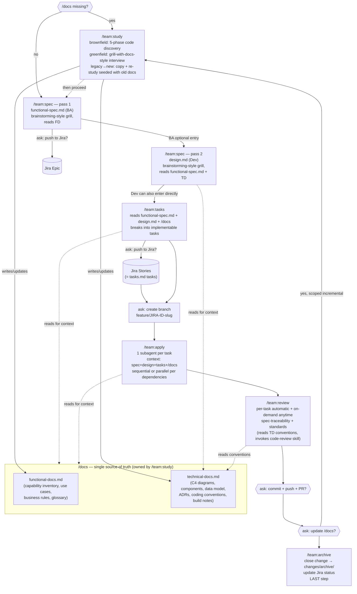

# Team AI-Collaboration Spec Workflow — Design Plan

## Context

The user wants to build a spec-driven collaboration workflow for their team, inspired by two references:
- **OpenSpec** (already installed in this repo as `openspec` CLI v1.6.0 + generated `.claude/skills/openspec-*` and `.claude/commands/opsx/*`): a spec-driven change pipeline — proposal → design → tasks → apply → archive — with an explore mode for pre-formalization thinking.
- **mattpocock/skills** (https://github.com/mattpocock/skills): a curated library of independent team disciplines (tdd, code-review, grill-me, ...) distributed via `npx skills@latest add` (editable copy) or a Claude Code plugin (read-only, auto-updating), with a one-time `/setup-*` onboarding command and shared `CONTEXT.md` domain docs.

Two roles need to collaborate through AI agents on a shared unit of work:
- **BA**: writes functional specs, breaks them into Jira Epics/Stories.
- **Dev**: writes technical specs, implements, and code-reviews.

The system must work across **greenfield** (nothing exists yet) and **brownfield** (existing codebase/specs to reconcile with) projects, and eventually be packaged/distributed to other teams (install + invoked commands), not just used locally.

This plan is being built incrementally through step-by-step, question-by-question requirements gathering with the user before any design or implementation is proposed.

---

# STATUS AS OF IMPLEMENTATION (read this first)

The CLI is built and working (`C:\Solutions\Kido`, npm package `kido`, symlink-installed via `npm link`, verified against a real brownfield repo at `D:\HedgeR`). 39 automated tests passing. The sections below (FINAL PLAN onward) are the **original design**, written before implementation — real usage surfaced gaps and one naming collision, fixed as follows. Where these contradict something below, **this section wins**.

## Corrections to the original plan

- **Skill naming**: generated skills are `mr-*` (e.g. `mr-study`, `mr-spec`), **not** `kido-*` as originally planned. Reason: Claude Code's `/` picker lists skills by their own folder name alongside commands — `kido-spec` (skill) and `kido:spec` (command) sharing the "kido" prefix meant typing `/kido` surfaced both, looking like duplication (12 entries for 6 stages). Commands stay `/kido:*` (unchanged); only the skill folder prefix changed. Mirrors openspec's own `openspec-explore` (skill) / `opsx:explore` (command) split — no shared prefix, no collision.

## New behavior added after the original design (not in the original decision log)

- **`kido init` now offers Jira setup**, not just docs setup — checks if credentials are already resolvable (env vars or `.kido-credentials`) first, only asks if genuinely unconfigured. Offers a choice: write directly to `.kido-credentials` (gitignored), or print env-var setup instructions. Token entry is plaintext (user's call). Non-interactive flag: `--skip-jira-setup`.
- **`kido jira sync --change <name> --epic <KEY>`** — explicit Epic override, always wins over whatever `functional-spec.md` would auto-create. Needed for Dev-only changes (no `functional-spec.md`, so no auto-Epic) and for attaching Stories to an Epic that already existed in Jira before adopting Kido. The `/kido:tasks` skill now asks about this explicitly before syncing.
- **Review enforcement fix**: the original `/kido:apply` skill said review "runs automatically" after each task — that's aspirational prose, not something Claude Code's skill mechanism actually guarantees (a skill can't force another skill to fire; only the agent's own judgment or an explicit user command invokes one). In real use, the agent skipped straight to "commit?" without ever running review. Fixed: `/kido:apply` and `/kido:archive` now explicitly instruct the agent that IT must perform the review itself, as the next required step in the same sequence — plus a guardrail forbidding "commit/push/Jira sync" suggestions until review has actually happened for every task.
- **Branch-naming fallback for no-Jira changes**: the original plan only specified `feature/<JIRA-ID>-<slug>` naming, with no fallback. Confirmed via real usage that declining Jira sync still needs *some* branch. Fixed: `/kido:tasks` now proposes `feature/<change-name>` (the kebab-case change folder name) when there's no Jira ID, and always lets the user override with a name of their own choosing either way — never treats the proposed default as final.
- **Commit scoping, resolved**: decided that `kido/changes/` (planning docs) SHOULD be committed to git — matches openspec's own precedent and the whole point of the tool being a durable, shared team asset (not just local scratch files). `.claude/` stays untracked (fully regeneratable via `kido init`, nothing lost). Mechanics: the feature code commit excludes both `kido/changes/` and `.claude/` by default (keeps the diff clean); once `kido archive <name>` moves the folder to `kido/changes/archive/<name>/`, that move gets committed **separately** (e.g. `docs: archive <name> planning docs`), so the planning history does land in git, just not mixed into the code commit.

## Known open gap, NOT yet resolved

- **PR-merge timing race**: if the code-commit PR (archive step 1) merges before the archive-docs commit (archive step 3) gets pushed, pushing to the same feature branch is risky — many teams auto-delete branches after merge, so the push could fail or land an orphaned commit outside the merged PR. Two candidate fixes were identified but not decided: (a) reorder so the docs/archive commits happen *before* the code push, so everything lands in one PR with a single push (simpler, but means "archived"/Jira-done reflects "submitted," not "actually merged"), or (b) detect merge state at archive time and, if already merged, commit directly to main instead of the feature branch (more accurate, bigger workflow change — archive can no longer auto-chain right after commit/push in one session). **Not implemented either way yet.**

## Reference artifact

A visual walkthrough of all 9 pipeline stages (kido init → study → spec ×2 → tasks → branch → apply → review → archive) with real example output at each step, using a "Swap Pricing" feature on a brownfield `pricing-service` as the running example: https://claude.ai/code/artifact/04e2e4b9-d268-4ff2-bb41-ce45a610fccb

---

# FINAL PLAN (original design — see corrections above for what changed since)

Everything below is the concrete synthesis of 61 decisions and 4 validated use-case walkthroughs (BA-initiated feature, Dev migration + cross-repo seeding, greenfield microservice, bug fix). Everything after this section (Visual Summary onward) is the supporting decision log/rationale — read it if you want the "why" behind any choice below; this section is the "what." **Note**: skill naming below (`kido-study` etc.) is superseded — see "Corrections" above; actual skills are `mr-*`.

## Product name & positioning

**Kido** — a standalone, npm-distributed CLI + set of generated Claude Code skills/commands for spec-driven BA/Dev collaboration, covering both greenfield and brownfield (including cross-repo rewrite) projects, one microservice repo at a time. Independent of `openspec` (avoids external-tool dependency, decision #12) and independent of any third-party skill library (patterns adapted, not depended on, decision #51).

## Package & build

- npm package (name TBD by the user, e.g. `kido` or `@org/kido`), **TypeScript**, bundled at build time (esbuild/obuild-style) to a single compiled output — published `package.json` ships with an **empty or near-empty `dependencies` array** (decision #15). devDependencies (TypeScript, bundler, test runner, any dev-only prompt/CLI-parsing libs) don't compromise this since they never ship to consumers.
- CLI binary: `kido`, exposed via `package.json`'s `bin` field.
- v1 targets **Claude Code only** for generated skills/commands, but the internal pipeline definition stays agent-agnostic (`{name, description, prompt body, required tools, args}` per stage) behind a renderer interface, so Gemini CLI/Kilo Code support can be added later as new renderers without touching the core (decision #14).
- Jira REST calls via built-in `fetch`, no SDK (decision #13's dependency-minimization goal).
- Jira credentials: user-scoped env var primary, gitignored local config file fallback (decision #16).

## Repo-side file layout (what `kido init` creates)

```
<microservice-repo>/
├── kido/
│   ├── docs/
│   │   ├── {project}-functional-docs.md      # BA-facing: capabilities, use cases, business rules, glossary
│   │   └── {project}-technical-docs.md       # Dev-facing: C4 diagrams, components, data model, ADRs, conventions
│   └── changes/
│       ├── <change-name>/                    # kebab-case, one per feature/bug in flight
│       │   ├── functional-spec.md            # feature path only
│       │   ├── design.md                     # feature path only
│       │   ├── tasks.md                      # feature path only
│       │   └── bug.md                        # bug path only (mutually exclusive with the three above)
│       └── archive/
│           └── <change-name>/                # moved here by /kido:archive, same shape as above
└── .claude/
    ├── skills/kido-*/SKILL.md                # generated, orchestration logic
    └── commands/kido/*.md                    # generated, explicit invocation (decision #27)
```

## CLI subcommands (thin, data-ops only — decision #17; skills hold all orchestration logic)

| Command | Behavior |
|---|---|
| `kido init` | Scaffolds `kido/docs/` + `kido/changes/` + generates the `.claude/skills/kido-*` and `.claude/commands/kido/*` files. If `/docs` is empty: asks "do you have legacy docs / a legacy repo to seed from?" (decision #59) — yes → triggers cross-repo export (decision #50); no → flags that `/kido:study` (greenfield mode) should be run next. |
| `kido new-change <name> [--type feature\|bug]` | Scaffolds `kido/changes/<name>/` with the right starter files for the chosen type. |
| `kido status --change <name>` | Reports which artifacts exist/are complete for a change (mirrors openspec's own `status` pattern, decision #37). |
| `kido validate --change <name>` | Checks required artifacts are present/well-formed before archiving. |
| `kido archive <name>` | Moves `kido/changes/<name>/` → `kido/changes/archive/<name>/`. |
| `kido jira sync --change <name>` | Pushes `functional-spec.md`/`tasks.md`/`bug.md` content to Jira (Epic/Story/Bug respectively, decisions #39/#61); stores returned IDs back into each file's frontmatter; idempotent (create-or-update by stored ID). |
| `kido docs export --to <path>` | Copies `kido/docs/*` into another repo — the literal-copy half of the cross-repo seeding flow (decision #50). |

## Generated skills/commands (orchestration logic)

| Command | Behavior |
|---|---|
| `/kido:study` | Three modes: **brownfield** — adapts the user's existing `discover-and-document` skill (5-phase: Inventory→Map→Deep-dive→Synthesize→Emit, decision #48) as-is. **Greenfield** — `grill-with-docs`-style interview (vision→capabilities→architecture→conventions, ADRs drafted live, hybrid termination, decision #49/#51). **Regeneration** — literal copy of a seed repo's `/docs` + re-run seeded with that copy as reference (decision #50). Repeatable/incremental at any time, including scoped per-change updates triggered from `/kido:archive` (decisions #22, #52, #60). |
| `/kido:spec` | First fork: **"bug or feature?"** (decision #61). **Feature**: dispatches by pipeline state — no `functional-spec.md` → creates it (BA); `functional-spec.md` done, no `design.md` → creates it (Dev, reading `functional-spec.md` + `technical-docs.md`) (decision #31). Both stages use Superpowers-`brainstorming`-style grilling: one question at a time, 2-3 approaches with tradeoffs, section-by-section approval, self-review, user-review gate (decision #51). Redirects to `/kido:study` first if `/docs` is missing (decision #30). Dev can enter directly at `design.md` for genuinely non-business-facing internal/infra work only — NOT for anything with functional/business impact, including migrations (decisions #18, #58). **Bug**: produces `bug.md` (description + reproduction scenario if known) — no grilling ceremony, no design/tasks. |
| `/kido:tasks` | Feature-path only. Reads `functional-spec.md` + `design.md` + `/docs`. Breaks work into vertical-slice, tracer-bullet tasks (schema/API/UI/tests together, independently completable/demonstrable — `to-tickets`-inspired, decision #37) with dependency ordering. Validates full `design.md` coverage. |
| `/kido:apply` | Feature-path only (bugs skip this, decision #61). One subagent per task, context bundle = `functional-spec.md` + `design.md` + this task + `/docs`. Sequential where `tasks.md` declares dependencies, parallel where independent. TDD — tests first (decision #23/#41). |
| `/kido:review` | Composable pipeline: spec-traceability (diff vs. `design.md`/`tasks.md`/`bug.md`) + standards (reads `technical-docs.md`'s conventions section, invokes the team's actual `code-review` skill rather than reimplementing checks, decision #25/#26). Runs automatically per-task during apply, AND is manually runnable anytime against the current branch (decision #44). Applies to bug fixes too (against `bug.md`'s description). |
| `/kido:archive` (git+docs+Jira lifecycle) | Once all tasks/the fix are done: **ask** commit+push+PR → **ask** update `/docs` (yes → scoped `/kido:study` re-run, seeded with this change's artifacts + diff) → close the change, move to `kido/changes/archive/`, update Jira status. Archive is always last (decision #45). Branch creation (asked first, `feature/JIRA-ID-slug` or `fix/JIRA-ID-slug`) happens once the Jira ID is known, before `/kido:apply` starts (decisions #45-47). |

## Jira hierarchy

`functional-spec.md` → Epic only. `tasks.md` tasks → Stories directly (no Sub-task level, decision #39). `bug.md` → Bug ticket, same tracker, distinct type (decision #61). Every sync point explicitly asks first — never silent (decision #28).

## Existing assets to reuse/adapt (not depend on as external packages)

- `C:\Solutions\Kido\skills\discover-and-document.skill` — becomes the engine for `/kido:study`'s brownfield mode, as-is (decision #48).
- Superpowers' `brainstorming` skill mechanics — adapt for `/kido:spec`'s per-change grilling (decision #51).
- mattpocock/skills' `grill-with-docs` pattern — adapt for `/kido:study`'s greenfield grilling (decision #51).
- mattpocock/skills' `to-tickets` vertical-slice philosophy — adapt for `/kido:tasks`' breakdown approach (decision #37).
- The team's own existing `code-review` skill (or equivalent) — invoked/reused, not reimplemented, for `/kido:review`'s standards stage (decision #26).

## Scope explicitly excluded from v1 (per earlier decisions)

- Gemini CLI / Kilo Code renderers (architecture supports adding them later, decision #14) — Claude Code only for now.
- Cross-microservice functional specs spanning multiple stores (decision #4) — one store per microservice, owner-microservice model only.
- Same-session BA+Dev live collaboration (decision #10) — async handoff only.
- Bidirectional Jira sync — one-way push only, per decision from the cost/feasibility assessment.

## Verification

This is a CLI + skill-generation tool, not an application with a UI — verification means:
1. **Unit tests** for the CLI's file/data operations: `kido init` scaffolding, `status`/`validate` logic, `archive`'s move operation, the Jira client (against a sandbox/mock Jira instance, exercising create-or-update idempotency for Epic/Story/Bug).
2. **Manual walkthrough of the 4 traced use cases** against the actual generated skills in a real (or sandbox) microservice repo once built: BA-initiated feature end-to-end (functional-spec→design→tasks→Jira→branch→apply→review→PR→docs-update→archive), Dev migration with cross-repo `/docs` seeding, greenfield microservice from scratch, and a bug fix (bug.md→Jira Bug→reproduce-with-failing-test→fix→review→archive). Confirms each command/skill behaves as designed against this plan, not just that code compiles.
3. **Dependency audit before each release**: inspect the published `package.json`'s `dependencies` field to confirm the near-zero-runtime-dependency goal (decision #13/#15) still holds as the tool evolves.

## Visual Summary

### Full pipeline



### Decision summary by theme

| Theme | Key decisions |
|---|---|
| **Source of truth / topology** | Tool owns specs, Jira is downstream (#1). Same repo as code (#3). One store per microservice (#4). Functional spec lives in the domain-capability "owner" microservice (#6). |
| **Pipeline shape** | One chain: functional-spec.md → design.md → tasks.md → apply → review → archive (#7). Dual entry points — BA or Dev can start (#18, #31). Features only, not bugs (#40). |
| **`/docs` (knowledge layer)** | Single source of truth, replaces per-capability specs (#20). Two files only: functional-docs.md + technical-docs.md, diagrams inline (#48) — adopts the user's existing `discover-and-document` skill as-is. Owned exclusively by `/team:study` (#51 interaction note). |
| **`/team:study`** (renamed from discover, #52) | Brownfield = 5-phase grounded code analysis (existing skill, #48). Greenfield = grill-with-docs-style interview (#49). Legacy→new = copy + re-study seeded with old docs (#50). Triggered explicitly + auto-suggested when missing/stale (#22). |
| **Grilling** | Two distinct modes: per-change (functional-spec/design) = Superpowers `brainstorming` mechanics; whole-project (`/team:study` greenfield) = `grill-with-docs` mechanics (#51). Patterns adapted/ported, not depended on (no runtime dependency). |
| **Jira** | functional-spec.md → Epic only; tasks.md tasks → Stories directly, no sub-task level (#39). Always asked before sync, never silent (#28). |
| **Git** | Branch created (asked first) once Jira ID known, named `feature/JIRA-ID-slug` (#45-47). Commit/push/PR asked after all tasks done, before archive (#45). |
| **Apply/Review** | Subagent-per-task dispatch, sequential/parallel per dependency graph (#23, #41). Review = composable pipeline: spec-traceability + standards (reads `/docs` conventions, invokes existing `code-review` skill), per-task AND on-demand (#25, #26, #44). |
| **Build/distribution** | Standalone CLI, independent of openspec, to minimize third-party runtime deps (#12, #13). TypeScript, bundled to near-zero shipped deps (#15). Claude Code only for v1, architected so Gemini CLI/Kilo Code can be added later via a per-agent renderer without touching the core (#14). CLI does data-ops only; skills hold orchestration logic (#17). Explicit commands alongside skills, e.g. `/team:spec`, `/team:tasks` (#27). Jira creds: env var, gitignored file fallback (#16). |

---

## Open Questions (answering one at a time)

1. **Source of truth**: Is Jira the system of record for stories (tool writes into it), or does the tool own specs and Jira is a one-way downstream mirror, or hybrid?
2. **BA/Dev handoff seam**: One continuous artifact chain (BA's functional spec = proposal.md, Dev's technical spec = design.md, same change) vs. two loosely-coupled stores (BA produces Jira-shaped artifacts, Dev starts a separate technical change referencing the ticket)?
3. **Greenfield vs brownfield**: One adaptive pipeline, or genuinely different entry commands (e.g. `/team:new-feature` vs `/team:extend`)? Does brownfield need a mandatory "explore existing system" step before either spec is written?
4. **Code review scope**: Generic diff review, or traceability review (does implementation satisfy what design.md/technical spec promised)?
5. **Multiplayer model**: Async handoff between BA-agent-session and Dev-agent-session (like OpenSpec today), or same-session/thread collaboration where Dev can query "why did BA scope it this way" grounded in the actual functional spec?

## Answers So Far

1. **Source of truth**: Tool owns specs (openspec-style store), Jira is a one-way generated mirror.
2. **BA/PM access model**: Clarified topology question first (see #3) — resolved same-repo, so BA/PM will clone the actual codebase repo to reach the spec store. Accepted tradeoff.
3. **Repo topology**: Same repo, colocated with code (like today's `openspec/` in this repo) — not a separate specs-only repo.
   - Growth concern raised (repo becoming "Jira + Confluence inside the repo") — addressed by OpenSpec's existing two-tier model: `specs/<capability>/` = living truth (Confluence-like, updated in place), `changes/` + `changes/archive/` = transient work (Jira-like, archived when closed). Real bloat risk is binary attachments (screenshots/mockups) — should link out to Figma/Confluence for heavy assets rather than embedding.
4. **Store scope**: One spec store per codebase/repo, NOT shared across multiple codebases. User is running **microservices** — one store per microservice.
5. **Domain context**: Functional specs should be organized around **business/domain capabilities** (e.g. "Swap Pricing", "IRS curve model"), NOT technical service boundaries (auth-service, api-gateway, etc. are technical, not functional). User's domain sounds like quant/trading finance (IRS = Interest Rate Swaps, pricing models). Corrected my earlier framing which wrongly used technical services as the cross-cutting example.
   - Still open: with per-microservice technical stores, and functional specs organized by domain capability (which may be realized by one or more microservices), where does the domain-level functional spec live?

6. **Domain spec home**: Functional spec lives in whichever microservice is the designated "owner" for that domain capability. Other affected microservices reference it by ID/link and open their own technical changes in their own stores.

7. **Handoff mechanics**: One chain, sequential stages within a single change: `functional-spec.md` (BA) → `proposal.md`/`design.md` (Dev) → `tasks.md` → apply → archive. Same dependency-ordered artifact model as OpenSpec today, extended with a BA-authored stage first. One `status` view spans the whole thing; Dev can't skip past an unfinished functional spec.

8. **Brownfield step**: Optional, offered but not enforced — same as today's `opsx:explore` pattern. Pipeline suggests an explore stage on brownfield changes but doesn't block progress if BA/Dev skip it.

9. **Code review scope**: Traceability review against the spec (design.md/tasks.md), not just generic diff review — checks correctness AND whether the implementation matches/deviates from what was designed. To be implemented as a **dedicated subagent** for the review process (not inline in the main session).

10. **Multiplayer model**: Async handoff, same as OpenSpec today — no live/same-session collaboration infrastructure. The artifact chain itself is the communication.

All 5 original open questions (plus follow-ups) are now answered. Remaining uncovered thread from the very first request: **distribution/packaging mechanics** for rolling this out across multiple microservice repos (installer vs plugin vs both, team onboarding/setup command, versioning/update story) — this was explicitly part of the original ask ("installations and then invoked commands for my team", mattpocock/skills-style).

11. **Distribution vision (as described by user)**: npm-installable CLI tool ("kit"), with an interactive setup selecting (a) which coding agent(s) to generate for (Gemini CLI, Kilo Code, Claude Code, ...) and (b) where to track features/tasks (local, Jira, Bitbucket, ...). Then `kit init` inside a project scaffolds skills + necessary files/dirs.

## KEY FINDING — openspec CLI already provides most of this

Checked `openspec --help` / `init --help` / `schema --help` / `store --help` / `config --help`:
- **Multi-agent generation already exists**: `openspec init --tools <list>` accepts a comma-separated list of 25+ tools (claude, gemini, kilocode, cursor, windsurf, codex, roocode, etc.). The "select your coding agent" step the user wants is already built.
- **Custom artifact chains already exist**: `openspec schema fork <source> <name>` and `openspec schema init <name>` let you create a project-local schema forked from the default `spec-driven` schema (`proposal → specs → design → tasks`). This is the mechanism to add a BA-authored `functional-spec` stage before `proposal`/`design`, rather than building a new pipeline engine.
- **Team config already exists**: `config.yaml` (currently empty in this repo) already has `context:` (project background for AI) and per-artifact `rules:` hooks.
- **Store registration already exists**: `openspec store` manages standalone registered OpenSpec repos — may be relevant infra even though the user chose same-repo colocation over separate stores.

**What genuinely does NOT exist yet (real new engineering)**:
- Jira sync (generate Epics/Stories from functional-spec.md, push one-way)
- Traceability code-review subagent (reads design.md/tasks.md + diff, checks correctness AND spec-conformance)
- Team onboarding flow that ties agent-selection + tracker-backend-selection + custom schema fork + config.yaml population into one guided setup (this could be a thin wrapper CLI/script over `openspec`, not a reimplementation of what it already does)

12. **Build vs extend decision**: Standalone CLI, independent of openspec — to avoid installing an external OSS tool and reduce security/supply-chain exposure.
13. **Security concern scope**: BROAD — minimize ALL third-party runtime dependencies, not just avoiding openspec specifically. Still wants npm as the distribution mechanism (confirmed in answer 11 — "installer with npm command for the tool").

## Cost/Feasibility Assessment Given to User

Feasibility is solid (CLI + templated file generation + REST integration, nothing exotic). Cost is driven by 4 scope choices, cheap version of each matches what's been decided so far:
- Schema engine: hardcode the one pipeline (functional-spec → proposal/design → tasks → apply/archive) rather than build a generic forkable DSL like openspec's.
- Agent targets: generate for only the agent(s) actually used, not all 25 openspec supports.
- Jira integration: one-way push only (create-or-update by ID), not bidirectional sync.
- Rollout: uniform pipeline across all microservice repos, no per-repo divergence.

Given "minimize all third-party runtime deps" + "npm command for distribution": ship an npm package with **zero/near-zero runtime `dependencies`** (empty or near-empty `dependencies` in package.json), using only Node built-ins:
- CLI arg parsing: hand-rolled (only ~6-8 subcommands, not worth a library like commander/yargs)
- Config format: plain JSON (native `JSON.parse`) instead of YAML, or a minimal hand-rolled subset parser if YAML-like feel is wanted
- Jira REST calls: built-in `fetch`/`https`, no SDK
- File/markdown generation: plain string templates, no templating engine
- devDependencies (build/test tooling, e.g. TypeScript compiler) are a separate concern from shipped runtime deps and don't compromise this goal since they don't ship to end users.

14. **V1 agent target**: Claude Code only, CONDITIONAL on adding Gemini CLI / Kilo Code later not being complicated. Verified via research (fetched Gemini CLI custom-commands docs and Kilo Code custom-modes docs):
    - **Gemini CLI**: genuinely cheap to add later. Same invocation paradigm as Claude Code — discrete, explicitly-typed command per file (`/namespace:command`). Different file syntax (TOML with a `prompt` field, vs Markdown+YAML) but that's a pure rendering difference.
    - **Kilo Code**: moderate complexity, not trivial. Uses Markdown+YAML like Claude Code, but invocation model differs — modes are persistent personas a user switches into (or that auto-invoke as subagents via `mode: subagent`), not one-shot commands per pipeline step. Requires translating command-per-step into mode-per-role, and Claude's `allowed-tools` list into Kilo's glob-based permission rules. Upside: Kilo's `mode: subagent` is a natural fit for the traceability-review subagent specifically.
    - **Design commitment to keep this cheap**: keep the pipeline definition agent-agnostic internally — each stage is `{name, description, prompt body, required tools, args}` — with a separate renderer per agent emitting the right file format. Ship only the Claude Code renderer for v1, add Gemini/Kilo renderers later without touching the core.

## Research: real-world precedent for language/dependency strategy

Checked both reference tools' actual package.json:
- `@fission-ai/openspec` (real openspec CLI): TypeScript → tsc, ships as **9 real runtime deps** in node_modules (@inquirer/core, @inquirer/prompts, chalk, commander, cross-spawn, fast-glob, ora, **posthog-node** [telemetry — phones home by default], yaml, zod). Concrete point in favor of the user's instinct to avoid depending on it — it's not just "an external tool," it has a telemetry dependency, relevant for a finance-domain security review.
- `skills` (vercel-labs, the real installer behind mattpocock's `npx skills add`): TypeScript, but bundled via `obuild` into a single compiled file at build time. Published package.json lists **exactly 1 runtime dependency** (`yaml`) despite using several libraries during development (prompts, git helpers, color output) — those get bundled into the output instead of shipped as separate installable packages.

**Revised recommendation given this precedent**: TypeScript + bundle-at-build (esbuild/obuild-style) lets the team use small well-known libraries as devDependencies for developer experience (type safety, a prompts lib for interactive setup, etc.) while shipping a package.json with an empty/near-empty `dependencies` array — better than the earlier framing of "hand-roll everything," since it gets both type safety AND near-zero installed footprint.

15. **Language/build strategy confirmed**: TypeScript, bundled to near-zero runtime deps (esbuild/obuild-style), published package.json dependencies empty or near-empty.

16. **Jira credentials**: Environment variable (user-scoped, no admin rights needed) as primary source, falling back to a local gitignored config file if the env var isn't set. Confirmed user-scoped env vars don't need admin rights (only machine-wide ones do) — team can revisit if their corporate machines turn out to restrict even that via Group Policy.

17. **CLI/skill split confirmed**: Option 1 — CLI is a thin, testable layer for file/data operations only (create/read/validate/archive); generated Claude Code skill files hold the actual BA/Dev orchestration logic (when to ask questions, how to move between stages, when to suggest Jira sync) and call the CLI for file operations. Matches openspec's proven split.

## Real-World Use Case: OpenSpec_Superpowers_Workflow_Reflection.md

User shared a personal reflection doc (French) about an active project: legacy Vue.js business app → Blazor WASM rewrite (REST, SignalR, WebSockets, TREP/Refinitiv market data, Consul service discovery, auth; target: Clean Architecture, Fluxor, MudBlazor, TDD). Confirms finance/trading domain (TREP = Refinitiv market data feed).

Their actual process: full manual mapping of existing app (pages, components, endpoints, SignalR/WebSocket flows, TREP, Consul, business rules, user workflows) BEFORE any code → defined target architecture → phased work → migrated page by page (analyze existing → think target → implement → refactor → test). For important pages used Superpowers: `/brainstorm → spec → plan → implementation via subagents → review → commit`.

Now discovering OpenSpec (`/specify → /plan → /tasks → /implement`), noticing overlap with Superpowers. Retrospective idea: start with `legacy.md` capturing existing system, then per feature run OpenSpec through tasks.md, but use **Superpowers only as the execution engine** (subagents fed spec+plan+tasks+architecture+guidelines+coding-standards, one task each) rather than OpenSpec's own `/implement`.

Further idea: tool-agnostic **"Engineering Kit"** — a `/docs` folder (product.md, architecture.md, features.md, engineering.md, coding-guidelines.md, adr/, diagrams/) as permanent, agent-updated project memory shared by both OpenSpec and Superpowers, letting either engine be picked per feature — plus a customizable review pipeline (architecture/security/performance/Blazor-Fluxor validation/acceptance criteria/test-gen/commit-prep).

**This was confirmed as accurately understood by the user.**

18. **Dev-only entry point**: CONFIRMED — a change can start at either functional-spec.md (BA-initiated) OR directly at proposal/design.md (Dev-initiated technical/internal work, e.g. a migration). Both entry points supported, not a single mandatory path.
19. **Major new insight from this use case**: the legacy-mapping/discovery step deserves a **dedicated workflow/command** (usable by BOTH BA and Dev, not folded into per-change "optional explore") that does a "code lecture" (reads/analyzes the existing repo) and produces a **complete layered report**: functional, architecture, design, techno, endpoints, etc. This same report/workflow could ALSO seed a fresh **greenfield** project's `/docs` — i.e., discovery output and manually-authored knowledge converge on the same `/docs` structure, just populated two different ways (extracted from code vs. authored from scratch), and layered so BA consumes the functional level while Dev consumes the architecture/design/technical level.
    - This directly re-opens/refines decision #8 (brownfield explore = optional/not enforced) — the user's lived experience suggests this discovery step is important enough to be a first-class artifact-producing workflow, not just an optional conversation.
    - This also raises a question about overlap with the earlier repo-topology decision (#3/#4's `specs/<capability>/spec.md` "living truth" tier) — is `/docs` the same concept, an extension of it, or a separate, more cross-cutting layer (architecture/ADRs/coding-guidelines/diagrams vs. per-capability specs)?

20. **/docs vs specs/**: CONFIRMED — `/docs` subsumes the earlier specs/<capability>/spec.md concept. Goal: any agent starting work on the repo has ONE source of truth (`/docs`), not two systems that could drift apart.
21. **Cross-repo requirement (settled, not a choice — stated need)**: Legacy repo (e.g. Vue.js app) and new greenfield repo (e.g. Blazor WASM app) are SEPARATE codebases/repos. Legacy-discovery runs against the legacy repo and produces `/docs` content there; this needs an explicit **export/copy step** to seed the new greenfield repo's `/docs` as a starting point. Not automatic/shared — a deliberate migration/copy action between two distinct repos.

22. **Discovery trigger**: Explicit command (e.g. `/team:discover`), PLUS the tool proactively suggests running it at key moments (starting a change against a repo with no `/docs` yet, or `/docs` older than the code it describes) — never runs unprompted on its own.

23. **Execution model**: CONFIRMED — subagent-per-task dispatch by default (matches Superpowers-style workflow from the use case doc). Tasks with dependencies run in order; independent tasks could run in parallel.
24. **Review refinement**: Review should include BOTH the spec-respect/traceability review (decision #9) AND a standards review covering Clean Architecture, TDD, SOLID, DRY, etc. — echoes the reflection doc's wishlist of a customizable review pipeline (architecture/security/performance/framework-specific validation/acceptance criteria/test-gen/commit-prep).
    - Open sub-question: should the standards checklist be dynamically driven by `/docs/coding-guidelines.md` (project-specific, configurable) rather than hardcoded, and should review be one combined subagent or a composable/pluggable pipeline of specialized review stages (matching the reflection doc's wishlist)?

25. **Review pipeline shape**: CONFIRMED — composable pipeline (option 1), with stages able to invoke/reuse existing review skills the team already has (e.g. Claude Code's own `code-review` skill, or a team-authored one) rather than reimplementing review logic from scratch inside the tool.
26. **Standards source**: CONFIRMED — both. `/docs/coding-guidelines.md` is the declarative source of truth for conventions (the "what"); a team-authored (or reused) code-review skill is the executable mechanism that actually performs the check (the "how"), reading the guidelines as context.

27. **Commands folder**: CONFIRMED — explicit commands alongside skills (e.g. `/team:propose`, `/team:discover`, `/team:apply`), matching openspec's own generated structure. Predictable, user-controlled invocation rather than relying on model auto-detection.

## Resolved: Open Threads From Before The Use-Case Doc

- **Greenfield vs brownfield entry**: resolved and substantially deepened via decisions #18-22 (dual entry points, dedicated discovery workflow, repeatable cadence, explicit+suggested trigger, cross-repo copy requirement).
- **Commands folder**: resolved via decision #27.
- **Workflow details**: substantially fleshed out through decisions #17-26 — the chain is now: `functional-spec.md` (BA, optional entry) → `proposal.md`/`design.md` (Dev, optional entry point too) → `tasks.md` → apply (subagent-per-task dispatch) → review (composable pipeline: spec-traceability + standards-via-coding-guidelines.md, reusing existing review skills) → archive/commit. Exact artifact template contents and CLI command surface are Phase-2-design-level detail, not further user decisions.

## Status

All major architectural threads resolved (27 decisions). User chose to keep drilling into the detailed per-stage workflow (functional-spec → design → tasks → apply → review) before synthesis. Now going stage by stage.

## Stage-by-Stage Workflow Design (in progress)

### functional-spec.md — refined
28. **Jira sync timing**: after the spec is marked ready, EXPLICITLY ASK the user (BA) whether they want to push to Jira — never silently auto-push. (A standalone re-sync command for later updates is still worth keeping alongside this.)
29. **Command naming**: `/team:spec` (not `/team:propose` or `/team:functional-spec`) — simpler unified name.
30. **No-/docs redirect**: If a project has no `/docs` yet, `/team:spec` should redirect to the discovery step first rather than proceeding blind. Reinforces decision #22. The discovery workflow's actual output/content still needs full design — flagged by user as its own topic to discuss next.
31. **Spec structure CONFIRMED**: One command (`/team:spec`), two sequential files. No functional-spec.md yet → creates it (BA content). functional-spec.md done, no design.md yet → creates design.md (Dev content), reading functional-spec.md for context. Dev can also run it directly to start at design.md with no functional-spec.md (decision #18).
32. **Role identity CONFIRMED**: no enforcement, pure convention — no identity/RBAC concept in the tool at all, matches openspec today.
33. **Grilling CONFIRMED, and extended**: mandatory pre-writing "grill"/brainstorming-style Q&A phase for BOTH functional-spec.md AND design.md (not just design.md) — open, challenging questions grounded in context (functional-spec.md + /docs for design.md; /docs/product.md + features.md for functional-spec.md) before writing anything.

### design.md — content proposal (was missing, user asked to fill in)
Invoked via `/team:spec` (dispatches by pipeline state), Dev-authored, mandatory grill phase (decision #33) reading functional-spec.md + relevant /docs first. Proposed content:
- Technical approach / chosen solution, with alternatives considered and why rejected (surfaced during the grill phase)
- Architecture impact: affected component(s)/microservice(s), new components introduced
- Data model / contract changes (schemas, shared DTOs, API endpoints, SignalR events — per the reflection doc's shared-DTO/Clean-Architecture conventions)
- Testing strategy (TDD approach, what gets unit vs. integration tested)
- Risks & mitigations
- ADR reference: if this design makes a significant architectural decision, link to a new/updated entry in `/docs/adr/`

### tasks.md — command confirmed, content confirmed, one new implication to resolve
35. **Command CONFIRMED**: separate `/team:tasks` command (option 1) — distinct activity from specifying, matches openspec's own separation and the reflection doc's /specify→/plan→/tasks split.
36. **Reads clarified**: `/team:tasks` reads BOTH functional-spec.md AND design.md (+ /docs context) — not design.md alone.
37. **Content CONFIRMED** (per-task: description, likely-touched files/areas, acceptance check/test-to-pass, dependencies for sequencing/parallelization; validates full design.md coverage), PLUS:
    - Should behave like openspec's own `/tasks` mechanic (dependency-ordered, schema-driven) — reuse the proven pattern, don't reinvent it worse.
    - **New implication raised**: "tasks may be Jira stories" — need to resolve the Jira hierarchy. Proposal: functional-spec.md syncs to Jira as **Epic + Stories** (decision #28/#1); tasks.md's individual tasks sync as **Sub-tasks** nested under the relevant Story — mirrors Jira's natural Epic→Story→Sub-task hierarchy and the functional-spec→design→tasks granularity already established. Needs confirmation.

38. **design.md content CONFIRMED**: holds technical decisions and approach for the current spec (option 1 from the proposal).
39. **Jira hierarchy CONFIRMED — option 2, two-level**: functional-spec.md syncs as just an **Epic** (no Stories at that stage). tasks.md's individual tasks ARE what become Jira **Stories** directly (not sub-tasks nested under separately-created Stories). Epic → Story, not Epic → Story → Sub-task.
40. **Scope boundary**: this entire pipeline manages **features only, not bugs**. Bug fixes are out of scope for this tool/workflow — presumably handled through a separate, lighter process not covered here.

### apply / review / archive — proposal to validate
41. **`/team:apply`**: reads tasks.md (+ design.md + functional-spec.md + /docs). Dispatches one subagent per task (decision #23), each given the full context bundle. Sequential where tasks.md declares dependencies; parallel where independent. Each subagent implements + writes tests for just its task (TDD convention). Updates tasks.md checking off completed tasks as it goes (mirrors openspec's own apply/status tracking).
42. **`/team:review`**: composable pipeline (decision #25) — spec-traceability stage (does the diff match design.md/tasks.md) + standards stage (reads `/docs/coding-guidelines.md`, invokes the team's existing review skill, e.g. Claude Code's own `code-review` skill) (decision #26). Runs per-task after apply, or across the whole change before archive — needs confirmation on timing.
43. **`/team:archive`**: closes the change (moves to `changes/archive/`), updates `/docs/*` (features.md gets the new/changed capability, architecture.md/adr/ updated if this design introduced a decision), updates the Jira Epic/Stories status.
44. **Review CONFIRMED, extended**: per-task (automatic during apply) AND on-demand — `/team:review` must also be manually runnable anytime against current changes/a branch, not only auto-triggered inside the pipeline.
45. **Full git lifecycle CONFIRMED (new thread, not previously discussed)**:
    1. Once tasks.md is ready (with Jira Story IDs synced, per decision #39) → **create a git branch named with the Jira ID**, BEFORE any dev/apply work starts
    2. `/team:apply` — implement each task on that branch (subagent per task)
    3. `/team:review` — per-task automatically, plus on-demand anytime
    4. Once all tasks done → **ask** whether to commit + push + open a PR
    5. Before final archive → **ask** whether to update global `/docs` (features.md/architecture.md/adr/coding-guidelines.md) based on decisions/changes made during the work
    6. `/team:archive` — close the change, move to `changes/archive/`, update Jira status. Archive is LAST, after the git/docs steps above.
    - **Open sub-question**: is branch creation (step 1) automatic once tasks.md+Jira sync is ready, or should it also explicitly ask first (consistent with the "ask before Jira sync," "ask before commit/PR," "ask before /docs update" pattern)? And what's the branch naming convention — just the Jira ID (e.g. `PROJ-1234`), or Jira ID + short slug (e.g. `feature/PROJ-1234-swap-pricing`)?
46. **Branch creation CONFIRMED**: asks first (once the Jira ID is known), consistent with every other consequential step in the pipeline.
47. **Branch naming CONFIRMED**: Jira ID + short slug (e.g. `feature/PROJ-1234-swap-pricing`).

## Full Pipeline Now Fully Specified (discovery → archive)

`/team:discover` → `/team:spec` (functional-spec.md → design.md) → `/team:tasks` (+ Jira Epic/Story sync) → branch creation (asked) → `/team:apply` (subagent-per-task) → `/team:review` (per-task + on-demand) → ask commit/push/PR → ask /docs update → `/team:archive`.

### /team:discover — MAJOR UPDATE: user already has a mature skill for this

User has an existing, working skill at `C:\Solutions\Kido\skills\discover-and-document.skill` (with README). It already does almost exactly what we designed:
- **Five-phase process**: Inventory (cheap breadth-first: file tree, stack detection, entry points, existing docs treated as claims to verify) → Map (module/component graph, dependency edges, data model, 3 surface kinds) → Deep-dive (trace 2-4 critical flows end-to-end, extract business rules) → Synthesize (reconcile map vs reality, reverse-engineer ADRs, verification loop) → Emit (write docs from templates).
- **Stack-agnostic**: detects the stack first, no assumed language/framework/vendor.
- **Grounding discipline**: every non-trivial claim cites a real file/symbol; unverifiable claims go to an explicit "open questions" section rather than being asserted.
- **Three first-class vendor-neutral surface kinds**: API surface (request/response), real-time/streaming channels, service topology (discovery & routing) — maps exactly onto the reflection doc's REST/SignalR/Consul reality.
- **Inferred ADRs explicitly marked as inferred** — already matches our earlier proposal, no new design needed there.
- **Output**: TWO files — `<project>-technical-docs.md` (C4 diagrams, component reference, data model, sequence diagrams, inferred ADRs, cross-cutting concerns, build/run notes) and `<project>-functional-docs.md` (capability inventory, use cases/user journeys, business rules, domain glossary, scope/assumptions) — diagrams embedded inline as Mermaid, not separate files.

48. **`/docs` schema SIMPLIFIED AND CONFIRMED**: adopt this skill's two-file convention as-is. `/docs` = `{project}-technical-docs.md` + `{project}-functional-docs.md` (diagrams inline via Mermaid) — NOT the originally-proposed seven separate files/folders. Every earlier reference in this plan to `/docs/coding-guidelines.md`, `/docs/architecture.md`, `/docs/adr/`, `/docs/features.md`, `/docs/product.md`, `/docs/diagrams/` now maps to a SECTION within one of these two consolidated files, not a standalone file:
    - Technical layer (Dev-relevant, decisions #26/#38/#42's coding-guidelines/architecture/ADR/testing-strategy references) → sections within `technical-docs.md`
    - Functional layer (BA-relevant, decisions #1's product/features references) → sections within `functional-docs.md`

**Remaining gaps this skill doesn't cover** (still need design):
- Greenfield mode (no code to explore — skill is fundamentally repo-exploration)
- Cross-repo export mechanism (decision #21 — copying legacy repo's `/docs` output into a new greenfield repo)

49. **Greenfield mode CONFIRMED**: grilling/interview session producing the same two-file output (functional-docs.md + technical-docs.md), populated by interview instead of code extraction. The grilling itself should be built adapting the `grill-with-docs` pattern discussed earlier (interview-style stress-testing, producing ADRs+glossary as it goes) — consistent with the earlier "adapt the pattern, don't depend on mattpocock's actual skill" decision.
50. **Cross-repo export REFINED**: not a pure literal copy alone, and not a pure automated transform alone — a **hybrid**: literally copy the legacy repo's `/docs` into the new repo first, THEN run the discovery/grilling workflow again in the new repo, *seeded with the copied legacy docs as reference material*, to produce the actual adapted `/docs` for the new project. This keeps a human (via grilling) in the loop deciding what carries over (e.g. business rules likely persist across a stack rewrite; architecture specifics don't) rather than fragile automated stripping logic.
    - **Naming note**: user flagged that "discover" may no longer be the right name for this skill/command, since it now also covers greenfield grilling and legacy-to-new-project regeneration, not just brownfield discovery. Not blocking — naming can be finalized during synthesis.

### Discovery/grilling mechanics — deeper proposal (user chose to drill here next)

**Greenfield grilling behavior**:
- Structured-but-adaptive question flow, not a fixed script: product vision/why → core capabilities → target architecture/tech stack → conventions, mirroring this very conversation's own style (open threads, not a checklist interrogation)
- **ADRs extracted live**: whenever a specific architectural decision crystallizes mid-conversation (e.g. "we'll use Fluxor for state management, because X"), draft that ADR entry immediately, not batched at the end — matches grill-with-docs' "produces ADRs...as the conversation progresses"
- **Termination**: hybrid — the skill has a completeness checklist (from the functional-docs.md/technical-docs.md templates' required sections) and proposes "I think we have enough for a first version" once satisfied, but the user can always say "keep going" or "stop now, generate what we have" at any point

51. **Grilling split CONFIRMED (per Claude's recommendation)**: two distinct grilling modes, not one unified behavior.
    - Per-change grilling (functional-spec.md/design.md) explicitly adopts **Superpowers' `brainstorming` mechanics**: one question at a time (multiple-choice preferred), propose 2-3 approaches with tradeoffs, present design section-by-section with approval gates, self-review (placeholders/contradictions/scope/ambiguity), user-review gate before moving to the next stage.
    - `/team:discover`'s greenfield mode follows the broader **`grill-with-docs` pattern**: continuous interview building ADRs+glossary as it goes, whole-project scope, not tied to one feature's spec-to-implementation path.
    - Rationale: these are genuinely different-sized problems (one feature vs. entire project knowledge base); forcing one behavior to serve both would just hide the same special-casing inside a single tangled codepath instead of two clean, purpose-built, independently-tunable ones.
52. **Naming CONFIRMED**: `/team:study` (renamed from `/team:discover`) — neutral, covers all three modes (brownfield discovery, greenfield grilling, legacy-to-new regeneration) without implying one-time-ness (unlike onboard) or colliding with existing `openspec-explore` semantics (unlike explore). All earlier references to `/team:discover` in this plan now read `/team:study`.

**How discovery/grilling interacts with the rest of the pipeline**:
- `/docs` (the two files) is OWNED by the discovery/grill workflow — `/team:spec`'s own grilling phase (decision #33) READS `/docs` for context but never overwrites it directly
- At archive time (decision #45 step 5, "ask whether to update /docs"), if yes: re-invoke the SAME discovery/grill skill in a **scoped, incremental mode** — fed the change's own artifacts (functional-spec.md, design.md, tasks.md, actual code diff) as grounding input, in addition to re-reading just the affected code area — rather than a separate, simpler ad-hoc section-editing mechanism. Keeps one single mechanism responsible for all `/docs` writes (full initial scan, greenfield grilling, AND incremental per-change updates), rather than three different code paths that could drift in how they format/structure the same two files.

## Use-Case Walkthrough #1: BA opens a new "Swap Pricing" capability

Traced full sequence: `/team:spec` (BA, redirects to `/team:study` if no `/docs`) → grill → `functional-spec.md` → ask Jira (Epic) → `/team:spec` (Dev, pass 2) → grill → `design.md` (+ ADR if applicable) → `/team:tasks` → ask Jira (Stories) → ask branch → `/team:apply` (subagent/task) → `/team:review` (per-task + on-demand) → ask commit/PR → ask `/docs` update (scoped `/team:study` re-run) → `/team:archive`. Matches the design as decided; no contradictions found.

53. **Gap surfaced by the walkthrough, now RESOLVED**: how does BA find the right "owner" microservice repo (decision #6) if they don't know the technical topology? **Resolved: BA simply starts the agent inside that microservice's repo directly** (same as Dev) — no capability→repo registry needed. Whatever repo BA is in when they run `/team:spec` IS where `functional-spec.md` gets created; there's no separate lookup step.

54. **Tool name CONFIRMED: "Kido"** (corrected from an initial mishearing of "Kiro" — matches this project directory's own name, `C:\Solutions\Kido`). Folder renamed `team/` → `kido/` throughout. (The earlier flagged AWS-"Kiro"-collision concern is moot — different name entirely.)
55. **File layout CONFIRMED** (shape validated, folder renamed per #54):
    ```
    <microservice-repo>/
    ├── kido/
    │   ├── docs/
    │   │   ├── {project}-functional-docs.md
    │   │   └── {project}-technical-docs.md
    │   └── changes/
    │       ├── <change-name>/            (kebab-case)
    │       │   ├── functional-spec.md
    │       │   ├── design.md
    │       │   └── tasks.md
    │       └── archive/
    │           └── <change-name>/
    ```
56. **`kido init` (or `kido --init`) behavior CONFIRMED**: users must run this once per repo to create the `kido/` folder structure. It automatically scaffolds `kido/docs/` and `kido/changes/`, and if the `/docs` files are missing (new repo onboarding), it prompts the user to run `/study` right away — reinforces decision #22's auto-suggestion behavior, now tied to `kido init` itself as the first touchpoint, not just the first `/kido:spec` call.
57. **Command prefix CONFIRMED**: `/kido:*` everywhere (e.g. `/kido:spec`, `/kido:study`, `/kido:tasks`, `/kido:apply`, `/kido:review`, `/kido:archive`) — one consistent name across CLI binary (`kido`), folder (`kido/`), and command prefix.

## Use-Case Walkthrough #2: Dev migrates a page (Spreading Configuration, Vue → Blazor), no BA

Traced: `kido init` on legacy repo → `/kido:study` brownfield → produces legacy `/docs`. `kido init` on separate new Blazor repo → cross-repo export (literal copy + reseeded `/kido:study` regeneration, decision #50) → adapted `/docs` for the new repo. Dev-only `/kido:spec` (skips functional-spec.md, decision #18/#31) → `design.md` grounded in both the new repo's `technical-docs.md` and the carried-over `functional-docs.md` description of the page's existing behavior (parity check) → `/kido:tasks` → branch → apply → review → commit → docs update → archive. Confirms the cross-repo export and Dev-only entry mechanics work together correctly.

58. **RESOLVED — reframed rather than picked from the three options**: user corrected the walkthrough's own premise. A page migration is NOT actually good example of Dev-only work — even "just" migrating an existing page has business/functional meaning (what should this page do post-migration, is behavior preserved or changed), so it SHOULD still go through BA's `functional-spec.md` stage (even if lightweight, e.g. "preserve existing behavior X/Y/Z" derived from the legacy `functional-docs.md`). This naturally produces the Epic via the existing mechanism (decision #39) — no new Jira-Epic logic needed.
    - **Narrows decision #18**: the Dev-only entry point still exists for genuinely non-business-facing internal/infra work (e.g. upgrading a dependency, refactoring an internal caching layer with zero user-facing impact) — but is NOT the right model for feature/page migrations, which should route through BA regardless of whether the change is "just" a rewrite.
59. **`kido init` REFINED for greenfield projects**: when initializing a brand-new (greenfield) repo, `kido init` should proactively ask **"do you have legacy docs / a legacy repo to seed from?"** — folding the cross-repo export trigger (decision #50) directly into the init flow's first-run experience, rather than relying on the user remembering to run it manually later as a separate step.

## Use-Case Walkthrough #3: brand-new microservice from scratch (trade-confirmation-service)

Traced: `kido init` → asked about legacy docs (decision #59), answered no → pure greenfield → `/kido:study` grilling (vision→capabilities→architecture→conventions, ADRs live, decision #49/#51) → produces initial `/docs` → first feature's `/kido:spec` reads the freshly-created `functional-docs.md`. Flows cleanly into walkthrough #1's pattern from that point on.

60. **One-sided grilling RESOLVED via existing repeatability decisions**: if only one role (e.g. Dev) is present for greenfield `/kido:study`, that's fine — fill what's answerable, mark the rest as open questions (same grounding discipline as brownfield mode, decision #48), and rely on `/kido:study` already being repeatable/incremental (decisions #22, #52) rather than one-shot. A BA can run it again later to flesh out the functional side; no need to gate on both roles being present upfront. No new mechanism needed — this was already implied by decisions already made, just not yet connected explicitly.

## Use-Case Walkthrough #4: bug fix scenario

61. **Decision #40 SUPERSEDED — bugs get a real, lighter lane, not full exclusion**:
    - `/kido:spec` gets a new first fork: **"bug or feature?"** — this is now the actual entry point of the whole pipeline, not a separate command.
    - **Feature** → existing chain unchanged (functional-spec.md → design.md → tasks.md → ...).
    - **Bug** → BA (or whoever found it) writes a lightweight **`bug.md`** in `kido/changes/<name>/` — just a description of the bug and, if known, a reproduction scenario/steps. No functional-spec/design/tasks ceremony.
    - Ask: push to Jira? → creates a Jira **Bug** ticket (distinct type from Epic/Story) from `bug.md`.
    - Dev picks up the Jira bug ticket → **reproduces the issue by writing a unit test first** (test fails, confirming reproduction) → implements the fix (test now passes) — TDD applied to bug-fixing specifically, not just features.
    - `/kido:review` (same composable pipeline: traceability — does the fix match `bug.md`'s description — + standards).
    - Ask commit/push/PR (same pattern as features).
    - `/kido:archive` — same mechanism, moves to `kido/changes/archive/`, bug fixes get the same historical record as features.
    - **No subagent-per-task dispatch needed by default** — a bug fix is typically one unit of work (reproduce + fix), so `/kido:apply`'s multi-task machinery isn't invoked; Dev/agent just does the reproduce-then-fix cycle directly. (Could still escalate to `/kido:tasks` if a bug turns out to need multi-task breakdown, but that's the exception, not the default.)

### /team:discover — original proposal (superseded by the above for brownfield mode, kept for greenfield-mode reference)

Two modes:
- **Brownfield**: reads the existing codebase — pages/components, REST endpoints, SignalR/WebSocket flows, external integrations (e.g. TREP-like), service dependencies (e.g. Consul-like), business rules, user workflows — mirrors exactly what the user did manually per the reflection doc. Produces layered `/docs` output:
  - `product.md` + `features.md` (functional layer, BA-relevant): business purpose, capability-by-capability breakdown of existing features
  - `architecture.md` + `engineering.md` + `coding-guidelines.md` (technical layer, Dev-relevant): current architecture, integration points, tech stack, observed conventions/patterns
  - `adr/`: best-effort inferred architecturally-significant decisions, explicitly flagged "inferred — please review" since ADRs are normally forward decisions, not perfectly reverse-engineerable
  - `diagrams/`: generated from discovered flows (e.g. SignalR flow, integration diagram)
- **Greenfield**: no code to read — guided interactive authoring session (grill-me style, same stance as functional-spec/design grilling) to establish initial `/docs` from scratch instead of extracting it
- **Scope control**: supports scoping to just an area/path (not always a full repo scan), matching decision #22's repeatable/incremental refresh
- **Cross-repo export**: a way to copy a legacy repo's `/docs` output into a new greenfield repo as a starting seed (decision #21's stated requirement)
