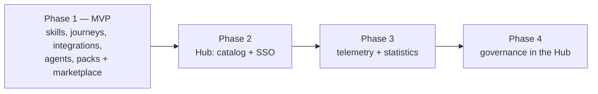

# 00 — Vision and scope

## 1. Problem

Teams using coding agents (Kilo Code today) get inconsistent results:

- Requirements are discussed in chat and lost; code is generated without a written, validated spec.
- Every developer prompts differently; there is no shared method (grooming, TDD, review, documentation).
- Handoffs between roles (manager, BA, developer, support) happen in Jira with little structure, and the
  agent has no access to that context.
- Quality tools (SonarQube, Checkmarx) live in CI and are consulted late.
- Useful prompts and integrations are copied between machines by hand; nobody knows who uses what.

## 2. Vision

TeamFlow gives every team member the same **spec-driven workflow** inside their coding agent:

> Describe what you want in plain language → TeamFlow routes the request to the right skill → the skill
> works with you (questions, proposals) → you validate at each important step → the result is code,
> specs and documentation that stay in the repository.

It is a **standard** for the organization: one method, written once, customizable per team without
forking, distributed and versioned like any other software, and observable (phase 3).

## 3. Users and roles

Roles change **where a person enters and leaves the workflow and how detailed the questions are**. They
never create a different workflow.

| Role | Typical entry | Typical exit | Handoff channel |
|---|---|---|---|
| Manager | Scoping a need | Spec + estimated breakdown | Jira (Epic + Stories) |
| BA | Grooming | Functional spec + design | Jira / Confluence |
| Developer | Spec or Jira key | Commit + pull request + archive | Bitbucket |
| Support | Bug or incident | `bug.md` + reproduction, optionally the fix | Jira (Bug) or continue as developer |

Anyone MAY go further than their typical exit if they have the rights (e.g. support fixing the bug
themselves) — with exactly the same gates (TDD, review) as a developer.

## 4. Principles

1. **Skills only.** No globally installed CLI. Everything the user triggers is a skill; deterministic work
   is done by **scripts bundled inside skills**.
2. **No MCP** (organization constraint). Integrations use scripts calling REST APIs.
3. **Files are the source of truth.** Specs, state and docs live in the target repository under
   `teamflow/`. Jira and Confluence are generated mirrors.
4. **One method, written once.** Grooming, templates, TDD and review rules live in shared references used
   by every journey.
5. **Human validation between phases.** No automatic chaining to commit or push.
6. **Deterministic where it matters.** Anything that must behave identically every time (ticket creation,
   idempotent sync, state transitions, pack installation, pass/fail of quality tools) is code, not prompt.
7. **Customizable without forking.** Teams override templates, checklists and configuration; a fixed set
   of invariants cannot be overridden.
8. **Agent-agnostic core.** Skills are authored once in a canonical format; a thin adapter installs them
   for a given coding agent. Kilo Code is the first and only MVP adapter.

## 5. MVP scope (phase 1)

### In scope

| Area | Content |
|---|---|
| Routing | Router skill `teamflow`, permanent Kilo rule (global), Kilo `chat.message` plugin |
| Journeys | New feature (solo and team), bug fix, document a project, explain code, legacy rebuild, on-demand agents, add a capability |
| Skills | `teamflow`, `tf-specify`, `tf-forge`, `tf-planify`, `tf-implement`, `tf-review`, `tf-archive`, `tf-document`, `tf-architecture`, `tf-explain`, `tf-jira`, `tf-bitbucket`, `tf-confluence`, `tf-packs` |
| Agents | Framework + `tf-agent-sanity`, `tf-agent-spec-traceability`, `tf-agent-sonarqube`, `tf-agent-checkmarx`, `tf-agent-secrets` (tool agents read CI results only) |
| State | `state.md` per topic, managed by a state script with enforced transitions |
| Customization | `teamflow/config.yml`, `teamflow/overrides/`, layered resolution |
| Integrations | Jira, Bitbucket and Confluence **Data Center** (Jira Cloud support retained from reused code) |
| Distribution | Pack format, `teamflow-marketplace` repo on Bitbucket DC, Jenkins pipeline, Artifactory staging/release, `tf-packs` skill, lockfile, bootstrap installer, `org-policy` pack |
| Adapter | Kilo Code adapter |

### Out of scope for the MVP (specified for later phases)

| Item | Phase |
|---|---|
| TeamFlow Hub web app — read-only catalog with SSO | 2 |
| Telemetry, usage statistics, fleet health dashboards | 3 |
| Governance actions from the Hub (approve, deprecate, policy pull requests) | 4 |
| Adapters for Claude Code and Gemini CLI | After MVP |
| MCP-based integrations | When the organization allows MCP |
| Local (non-CI) runs of SonarQube / Checkmarx | After MVP |
| Cryptographic signing of packs | After MVP (checksums only in MVP) |
| Cross-repository features spanning several microservices | Not planned |

## 6. Phases

Phase 1 MUST be fully usable without the Hub.

## 7. Success criteria for the MVP

| # | Criterion | Measure |
|---|---|---|
| S1 | A developer installs TeamFlow on a new machine | Bootstrap + first `tf-packs sync` in under 10 minutes on Windows and Linux |
| S2 | Solo feature end to end | A pilot developer delivers a real feature from a one-line request to a Bitbucket pull request with spec, tests and updated docs, with every gate respected |
| S3 | Team handoff | A BA creates a spec and Jira Epic/Stories; a developer on another machine resumes with `implement <JIRA-KEY>` without re-explaining anything |
| S4 | Idempotent integrations | Re-running any Jira/Confluence sync never creates duplicates (automated tests) |
| S5 | Routing quality | ≥ 90 % of the reference routing scenarios (see [13](13-mvp-plan.md)) pick the expected skill |
| S6 | Customization | A pilot team replaces the functional-spec template and adds a checklist without modifying any pack |
| S7 | Distribution | A pack change merged on Bitbucket DC is installable from Artifactory release by `tf-packs update` without manual steps |

## 8. Constraints

- Coding agent: **Kilo Code** (VS Code extension and CLI).
- **No MCP servers.**
- Atlassian **Data Center**: Jira, Confluence, Bitbucket. CI: **Jenkins**. Artifacts: **Artifactory**.
- Developer workstations: **Windows and Linux** (macOS best effort). All scripts MUST run on Node.js ≥ 20
  with no shell-specific syntax.
- Scripts are bundled to single files; they MAY bundle third-party libraries at build time but MUST NOT
  require `npm install` on the workstation.
