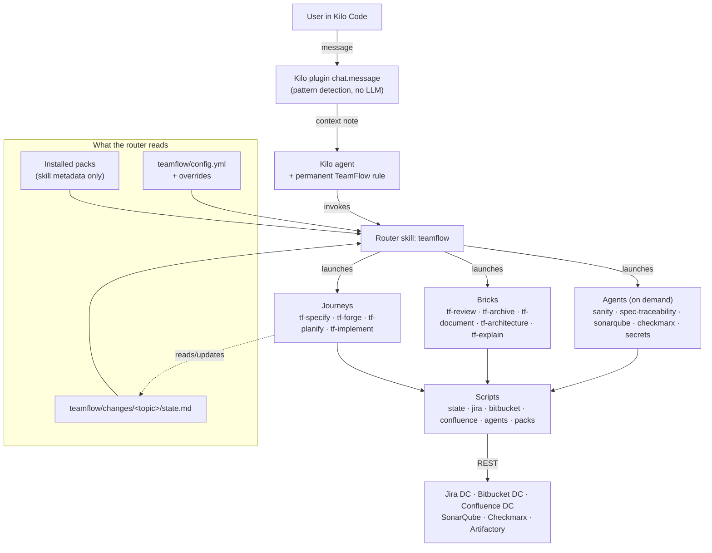
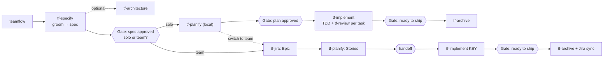

# 02 — Architecture

Visual version: [diagrams/architecture.html](diagrams/architecture.html).

## 1. Layers

```
┌──────────────────────────────────────────────────────────────────────┐
│ ROUTING      Kilo rule + optional Kilo plugin → router skill `teamflow` │
├──────────────────────────────────────────────────────────────────────┤
│ JOURNEYS     tf-specify · tf-forge (solo) · tf-planify · tf-implement  │
├──────────────────────────────────────────────────────────────────────┤
│ BRICKS       tf-review · tf-archive · tf-document · tf-architecture ·  │
│              tf-explain                                                │
├──────────────────────────────────────────────────────────────────────┤
│ AGENTS       tf-agent-sanity · -spec-traceability · -sonarqube ·       │
│              -checkmarx · -secrets  (on demand only)                   │
├──────────────────────────────────────────────────────────────────────┤
│ INTEGRATIONS tf-jira · tf-bitbucket · tf-confluence  (scripts)         │
├──────────────────────────────────────────────────────────────────────┤
│ METHOD       shared references: grilling · templates · TDD · review ·  │
│              state rules · conventions                                  │
├──────────────────────────────────────────────────────────────────────┤
│ DISTRIBUTION packs · tf-packs · packs.lock · marketplace · adapter      │
└──────────────────────────────────────────────────────────────────────┘
```

| Layer | Responsibility | Deterministic? |
|---|---|---|
| Routing | Make sure the request reaches the right skill with the right context | Rule and plugin: yes. Router decision: LLM |
| Journeys | Drive a topic through phases with gates | LLM, but state transitions go through the state script |
| Bricks | Reusable steps used by both journeys | LLM + scripts |
| Agents | On-demand analysis; tool agents read tool results | Pass/fail decided by the tool, triage by the LLM |
| Integrations | Talk to Jira, Bitbucket, Confluence | Yes (scripts) |
| Method | The single written method | Text |
| Distribution | Install, verify, lock, update packs | Yes (scripts + CI) |

## 2. Component and flow overview



## 3. Routing

Routing has three pieces, each with one job:

| Piece | What it is | Job | Does NOT |
|---|---|---|---|
| **Permanent rule** | An instruction registered once per workstation in Kilo's **global** configuration by the bootstrap installer **(verify exact location)** | Tells the agent, in every session: "for any work topic (feature, bug, documentation, rebuild, code question about this repo) or any analysis request, use the `teamflow` skill first, unless the user invoked a skill explicitly" | Decide anything |
| **Kilo plugin** | A small JS module subscribed to `chat.message`, installed globally **(verify)** | Detect obvious signals with patterns (Jira key `[A-Z][A-Z0-9]+-\d+`, agent keywords, an in-progress topic) and add a short context note | Choose or launch a skill; call an LLM; take more than 50 ms |
| **Router skill `teamflow`** | A skill | Decide: which skill, agent or agent group; or ask exactly one question | — |

The plugin is **part of the MVP**. Work package WP-02 ([13](13-mvp-plan.md)) verifies how Kilo exposes the
per-message event and how context can be added; WP-11 implements the plugin with the confirmed mechanism.
If a capability is missing, the closest available mechanism is used and the gap is recorded in
[14](14-decisions-and-open-questions.md). The rule and skill descriptions remain the baseline routing.

### 3.1 Router decision table

The router evaluates rules top to bottom; the first match wins.

| # | Signal | Decision |
|---|---|---|
| 1 | The user invoked a skill explicitly (`/tf-forge`, `/tf-agent-sonarqube`, …) | The router is not involved |
| 2 | A Jira key is present and refers to work to do | `tf-implement <KEY>` |
| 3 | The request names an agent or agent group ("SonarQube analysis", "check security", "check everything before the PR") | The agent or group; context = current topic, branch, PR |
| 4 | The request is about installing, listing or updating capabilities | `tf-packs` |
| 5 | An in-progress topic matches the request | Offer to resume it at the phase recorded in `state.md` |
| 6 | "Document this project / service / module" | `tf-document` |
| 7 | Rebuild / rewrite / modernize an existing application | `tf-document` in rebuild mode, then `tf-architecture` (rebuild journey) |
| 8 | New feature or change request | `tf-specify` (type `feature` or a matching custom spec type) |
| 9 | Bug, incident, regression | `tf-specify` (type `bug`) |
| 10 | Question about how existing code works | `tf-explain` |
| 11 | Explicitly team-oriented ("for the team", "push to Jira") | `tf-specify`, mode preset to `team` |
| 12 | Unrelated to TeamFlow | Answer normally, no skill |
| 13 | Ambiguous | Ask **one** question listing the 2–3 plausible options |

The router MUST:
- read only metadata of installed skills (name, description, TeamFlow frontmatter), not their bodies;
- pass the resolved context (topic id, phase, branch, PR id, spec paths) to the invoked skill;
- report when a needed pack is missing and offer `tf-packs install <pack>` instead of failing.

## 4. Journeys at a glance



`tf-forge` is the solo journey as a single entry point: it chains `tf-specify` → `tf-planify` (local) →
`tf-implement` → `tf-archive` in one session, with the same gates. Details in [04](04-user-journeys.md).

## 5. Target repository layout

Created and maintained by TeamFlow inside a team's application repository:

```
<repo>/
├── teamflow/
│   ├── config.yml                       # team configuration (07)
│   ├── packs.lock                       # exact pack versions + checksums (10) — committed
│   ├── overrides/                       # team customizations (07)
│   │   ├── templates/
│   │   ├── checklists/
│   │   ├── spec-types/
│   │   └── agents/
│   ├── docs/                            # durable documentation, written only by tf-document / tf-architecture
│   │   ├── <project>-functional.md
│   │   ├── <project>-technical.md
│   │   └── adr/ADR-<nnnn>-<slug>.md
│   └── changes/
│       ├── <topic>/
│       │   ├── state.md                 # (06)
│       │   ├── functional-spec.md       # feature
│       │   ├── design.md                # feature
│       │   ├── tasks.md                 # feature with several tasks
│       │   ├── bug.md                   # bug
│       │   ├── rebuild.md               # rebuild program
│       │   └── checks/<agent-id>.md     # agent reports (08)
│       └── archive/<topic>/             # same shape, after tf-archive
└── <application code>                  # nothing agent-specific is installed in the repository
```

User-level files (never in a repository):

```
~/.teamflow/
├── profile.json            # the user's default role (04)
├── org-overrides/          # organization overrides, installed by the org-policy pack (07)
├── cache/packs/            # downloaded pack archives
└── logs/                   # script logs, rotated
```

Credentials live in `~/.config/kilo/teamflow.credentials` (user-only permissions, see [09](09-atlassian-integrations.md)).

All packs (including `teamflow-core`) are installed **globally**, once per workstation, in the coding
agent's user-level skills folder (Kilo: `~/.kilocode/skills/` **(verify)**). Nothing is installed per
repository; `teamflow/packs.lock` only declares the versions a repository requires ([10](10-marketplace-and-packs.md) §5).

## 6. Source repository layout (TeamFlow itself)

The TeamFlow source lives in the `teamflow-marketplace` repository on Bitbucket DC (see [10](10-marketplace-and-packs.md)):

```
teamflow-marketplace/
├── shared/                    # the method, written once (copied into skills at build time)
│   ├── method/                #   grilling.md, tdd.md, review-protocol.md, state-rules.md
│   ├── templates/             #   functional-spec.md, design.md, tasks.md, bug.md, rebuild.md
│   └── conventions/           #   artifact-layout.md, naming.md
├── src/                       # TypeScript for all scripts + unit tests
│   ├── state/  config/  jira/  bitbucket/  confluence/  agents/  packs/  adapters/  common/
├── packs/
│   ├── teamflow-core/         # router, journeys, bricks, tf-explain, tf-packs
│   ├── teamflow-jira/
│   ├── teamflow-bitbucket/
│   ├── teamflow-confluence/
│   ├── teamflow-agents-quality/   # sanity, spec-traceability, sonarqube
│   ├── teamflow-agents-security/  # checkmarx, secrets
│   └── org-policy/
├── community/                 # team-contributed packs
├── schemas/                   # JSON Schemas: pack manifest, config, state, check report, index, lockfile
├── tools/                     # build, validate, index, publish, bootstrap installer
├── evals/                     # routing and skill scenarios (13)
└── Jenkinsfile
```

**Build rule:** shared references and shared scripts (e.g. the state script) are **copied into each
skill that needs them** at build time, so every installed skill folder is self-contained and never
reads another skill's folder at runtime.

## 7. Invariants (cannot be overridden)

1. Topic artifacts live in `teamflow/changes/<topic>/`; `state.md` follows the schema in [06](06-artifacts-and-state.md).
2. Every phase change goes through the state script, which enforces allowed transitions and required gates.
3. Human gates: spec approved before planning/implementation; plan approved before implementation when
   `tasks.md` exists; explicit confirmation before commit/push and before any write to Jira, Bitbucket
   or Confluence.
4. TDD proof: for each task, the failing test run and the passing test run are both shown and recorded.
5. Spec-traceability review runs after each task before the task is marked done.
6. Writes to external systems go through integration scripts only.
7. Enforced packs and enforced agents defined by the org policy cannot be disabled by a team.
8. `teamflow/docs/` is written only by `tf-document` and `tf-architecture`.

## 8. Technology choices

| Concern | Choice | Reason |
|---|---|---|
| Scripts | TypeScript compiled and bundled with esbuild to one `.mjs` file per script, Node.js ≥ 20 | Same language as the reusable code ([12](12-reusable-code.md)); no install on workstations |
| YAML | A YAML library bundled into scripts at build time (e.g. `yaml`) | `state.md` and `config.yml` are nested; the flat frontmatter parser in `src/lib/frontmatter.ts` is insufficient |
| Schema validation | JSON Schema files in `schemas/`, validated by a bundled validator (e.g. `ajv`) | Same schemas used by scripts, CI and the Hub |
| HTTP | Built-in `fetch` | No SDKs |
| Tests | `node --test` + fake HTTP servers (pattern already used in this repository's `test/` folder) | Fast, no dependencies |
