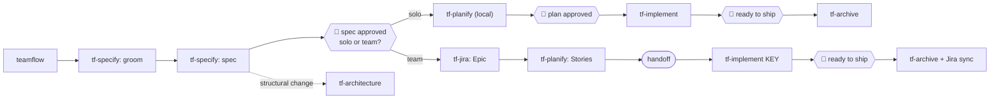
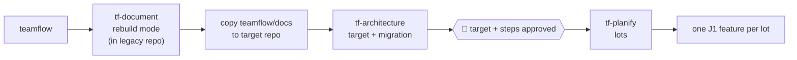

# 04 — User journeys

Beginner-friendly visual version: [diagrams/getting-started.html](diagrams/getting-started.html).
Phase/gate details: [06](06-artifacts-and-state.md) and [diagrams/state-machine.html](diagrams/state-machine.html).

Conventions in this file: 🛑 marks a human gate; `→ state:` shows the state-script call that records it.

## J1 — New feature

**Example request:** "I want to add a feature to change the stock type."

### Steps

1. **Routing.** The router finds no Jira key and no matching in-progress topic, recognizes a new feature,
   and checks prerequisites:
   - `teamflow/docs/` empty while the repository has code → offer `tf-document` first.
   - A topic with a similar name exists → ask whether it is the same topic.
2. **Topic creation.** `tf-specify` proposes a kebab-case topic id (`change-stock-type`) and runs
   `→ state: init --topic change-stock-type --type feature --role <role>` (phase `groom`).
3. **Grooming** (reference `grilling.md` + active checklists). One question at a time, grounded in
   `teamflow/docs/`:
   > "The documentation lists three stock types: Available, Reserved, Blocked. Do you want to change the
   > type of an existing stock item, or add a new type?"

   > "Who changes it: an operator in the UI, a batch job, another service?"

   > "What happens to open reservations if a Reserved stock becomes Blocked? Options: (A) reject the
   > change, (B) cancel the reservations, (C) keep them and flag them. I recommend A because…"

   Grooming MUST cover boundary, failure and concurrent-access cases before the spec is written. Every
   decision is appended to `state.md` → Decisions.
4. **Spec.** `→ state: set-phase spec`. Writes `functional-spec.md` and `design.md` from the resolved
   templates (see [07](07-customization.md)), presenting **one section at a time** for approval.
   - If the change is structural (new service, new integration, data migration, cross-service event,
     infrastructure) or `phases.architecture: always`, offer `tf-architecture` (`→ state: set-phase architecture`).
5. 🛑 **Spec approved.** `→ state: gate spec-approved`. Then the **mode question** (skipped if
   `defaultMode` is `solo` or `team`):
   > "The spec is ready (2 business rules, 1 published event, about 3 tasks). Do you continue **alone**
   > to the code, or **push it to Jira** for the team?"

   `→ state: set-mode solo|team`.
6. **Solo branch** (also the whole of `tf-forge`):
   1. `tf-planify` writes `tasks.md` locally (vertical slices, dependencies) `→ state: set-phase plan`.
      Single-task features MAY skip `tasks.md` (the topic is implemented as one task).
   2. 🛑 Plan approved `→ state: gate plan-approved`.
   3. `tf-implement` `→ state: set-phase implement`: proposes the branch name from `naming.branch`,
      🛑 confirms it, creates it (`tf-bitbucket branch`), then per task: failing test shown → code →
      passing test shown → `tf-review` → `→ state: task <n> --status done --reviewed`.
   4. 🛑 Ready to ship → `tf-archive` (J8).
7. **Team branch:**
   1. 🛑 Confirm the Jira push → `tf-jira sync` creates the Epic and attaches the spec files **and
      `state.md`**; `→ state: set jira.epic <KEY>`. A BA without push rights never commits: `state.md`
      stays local and Jira carries it (re-attached at every sync).
   2. `tf-planify` writes `tasks.md` and 🛑 confirms the Stories push → `tf-jira sync` creates one Story
      per task under the Epic.
   3. Handoff: a developer later says "implement PROJ-456" → `tf-implement` runs `tf-jira pull PROJ-456`
      (restores the spec files, `tasks.md` and `state.md` exactly as the BA left them) and continues as in
      the solo branch step 6.3. From then on `state.md` is committed with each commit on the topic branch.
8. **Switching mode.** A solo topic can switch to team at any time ("this is bigger than expected, push
   it to Jira"): `tf-jira sync` uses the same files; `→ state: set-mode team`. A team topic can be
   finished with `tf-forge` by whoever pulled it.

## J2 — Bug fix

**Example:** "VAT is computed wrong for Belgium."

1. Router → `tf-specify` with type `bug` `→ state: init --type bug`.
2. Grooming focuses on reproduction: observed vs expected, inputs, environment, frequency, first seen.
3. `bug.md` written from the template. 🛑 "Is this the bug?" `→ state: gate spec-approved`.
4. Mode question (team = create a Jira Bug via `tf-jira`).
5. `tf-implement`: branch from `naming.bugBranch`; **reproduce first**: write a test that fails for the
   described reason, show the failure; fix; show the pass; `tf-review` against `bug.md`.
6. 🛑 Ready to ship → `tf-archive`.

If the fix turns out to need several tasks, `tf-implement` stops and proposes `tf-planify`.

## J3 — Document a project

**Example:** "Document this service." (or `/tf-document`)

1. `tf-document` runs five steps: **inventory** (stack, entry points, build) → **map** (modules,
   dependencies, data stores, integrations) → **deep dive** (per module: responsibilities, business rules,
   data model) → **synthesize** → **emit** `teamflow/docs/<project>-functional.md`,
   `<project>-technical.md`, ADRs for decisions found in code.
2. Every statement MUST cite a real file/symbol; uncertainties are listed as **open questions**, never
   invented.
3. 🛑 The user reviews the open questions; answers are folded in.
4. Optional: 🛑 publish to Confluence via `tf-confluence publish` (one-way).

No topic is created; documentation is not a phase-driven topic.

## J4 — Explain code

**Example:** "Explain how PriceCalculator works."

1. Router → `tf-explain` (read-only).
2. Reads the code and `teamflow/docs/`, answers with file/line references.
3. Creates **no files**. If the discussion reveals a bug, a missing doc or an improvement, it offers the
   matching journey (J2, J3 scoped, J1).

## J5 — Legacy rebuild

**Example:** "We are rewriting the Billing app in .NET 8."

1. `→ state: init --type rebuild` (topic in the **target** repository).
2. `tf-document` in **rebuild mode** runs on the legacy repository (reference `rebuild-checklist.md`):
   exhaustive business rules including hard-coded special cases, integrations and formats, data and
   migrations, odd behaviors users rely on, dead code not to rewrite.
3. The legacy `teamflow/docs/` is copied into the target repository (`tf-document import --from <path>`).
4. `tf-architecture`: target architecture options with trade-offs, ADRs, C4 views, deployment,
   observability, migration strategy (e.g. strangler), rollback.
5. 🛑 Target and migration steps approved `→ state: gate architecture-approved`.
6. `tf-planify` splits into **lots**; each lot becomes a child feature topic (`parent: <rebuild-topic>`)
   that follows J1. The rebuild topic tracks lot status.

## J6 — On-demand agents

**Examples:** "Run a Sonar analysis on my branch", "check everything before the PR", `/tf-agent-checkmarx`.

1. Explicit invocation → the agent runs directly. Otherwise the router matches the agent's `triggers`
   or an agent group.
2. The router passes context: topic, branch, PR id (from `state.md` or git).
3. The agent writes `checks/<agent-id>.md` (or a temporary report when no topic is active), summarizes
   findings by severity and **proposes** fixes; it never edits code without approval.
4. Groups run their agents in isolated contexts in parallel when the coding agent supports it, and
   produce one aggregated report.

Agents never run automatically inside a workflow. At ship time `tf-archive` only **verifies** that
agents listed in `agents.requiredBeforeShip` have a report for the current commit, and offers to run
the missing ones. Details: [08](08-agents-and-checks.md).

## J7 — Add a capability

**Examples:** "Which security agents exist?", "Install the Checkmarx pack", "Update my packs".

1. Router → `tf-packs`.
2. `list`/`search` read the Artifactory release `index.json`.
3. `install`: resolves dependencies, displays what the pack does (`executesCode`, `sideEffects`,
   required credentials), 🛑 asks for confirmation, downloads, verifies the SHA-256, installs through the
   adapter, updates `teamflow/packs.lock`.
4. The new skills are usable immediately (the router reads installed metadata).

Details: [10](10-marketplace-and-packs.md).

## J8 — Ship (end of J1, J2 and each rebuild lot)

`tf-archive`:
1. Verifies every task is `done` and `reviewed`; refuses otherwise.
2. Verifies `requiredBeforeShip` agents (J6); offers to run missing ones; failing enforced agents block;
   failing non-enforced agents require a **waiver** (reason recorded `→ state: waive`).
3. 🛑 Proposes the scoped documentation refresh (`tf-document --scope <topic>`).
4. Moves the topic to `teamflow/changes/archive/<topic>/` `→ state: set-phase archived`.
5. 🛑 Commits code + docs + archived topic, pushes the branch, opens the pull request via
   `tf-bitbucket pr` with a description generated from the spec. **Everything lands in one push before
   merge** (decision D-17).
6. Team mode: 🛑 syncs changed spec files back to Jira and transitions issues (`tf-jira sync`,
   `tf-jira transition`).
7. Optional: 🛑 `tf-confluence publish`.

## Roles in the journeys

| Role | Default entry | Default stop | Notes |
|---|---|---|---|
| Manager | J1 grooming | After Stories are in Jira | Questions avoid technical depth |
| BA | J1 grooming | After spec (+ optional plan) in Jira | May draft `design.md`, flagged for developer validation |
| Developer | J1/J2 or `implement <KEY>` | After J8 | — |
| Support | J2 | After `bug.md` in Jira, or after J8 if fixing | Same TDD and review gates when fixing |

The router asks for the role once per user and stores it in `~/.teamflow/profile.json`
(`{ "role": "developer" }`); it can be changed at any time ("I'm acting as BA today").
