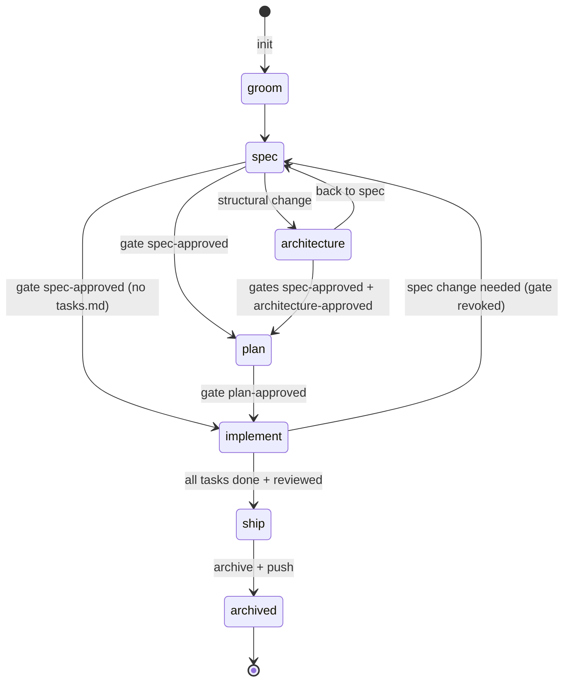

# 06 — Artifacts and state

Visual version of the state machine: [diagrams/state-machine.html](diagrams/state-machine.html).

## 1. `state.md`

One per topic: `teamflow/changes/<topic>/state.md`. YAML frontmatter (machine-owned, schema
`schemas/state.schema.json`) + Markdown body (human-readable log, appended by the script).

```yaml
---
schema: 1
id: change-stock-type              # kebab-case, equals the folder name
title: Change the type of a stock item
type: feature                      # feature | bug | rebuild | <custom spec type id>
mode: undecided                    # undecided | solo | team
phase: implement                   # see §2
role: developer                    # role of the person who created the topic
parent: null                       # rebuild topic id for a lot
created: 2026-10-01T09:12:00Z
updated: 2026-10-02T16:40:11Z
jira:
  epic: PROJ-456                   # or null
  issue: null                      # Story (small feature) or Bug key
branch: feature/PROJ-456-change-stock-type
pr: null                           # Bitbucket PR id once opened
gates:
  - { name: spec-approved, at: 2026-10-01T11:02:00Z, by: "j.doe" }
  - { name: plan-approved, at: 2026-10-01T11:20:00Z, by: "j.doe" }
tasks:
  - id: 1
    title: Stock type change endpoint
    status: done                   # todo | in-progress | done | blocked
    jira: PROJ-457
    tdd:
      red:   { cmd: "dotnet test --filter StockTypeChange", exit: 1, at: 2026-10-02T09:01:00Z }
      green: { cmd: "dotnet test --filter StockTypeChange", exit: 0, at: 2026-10-02T09:30:00Z }
    reviewed: true
  - { id: 2, title: Reservation conflict rule, status: in-progress, jira: PROJ-458, reviewed: false }
checks:
  sanity: { status: pass, commit: 3f2a9c1, at: 2026-10-02T16:30:00Z }
waivers:
  - { check: sonarqube, reason: "Quality gate fails on legacy file outside scope", by: "j.doe", at: 2026-10-02T16:35:00Z }
---
# Change the type of a stock item

## Decisions
- 2026-10-01 Reject the type change when open reservations exist (grooming, option A).

## Log
- 2026-10-01T09:12Z init (feature, developer)
- 2026-10-01T11:02Z gate spec-approved
```

`by` is the git `user.name` of the workstation. Timestamps are UTC ISO-8601.

### 1.1 Lifecycle and transport of `state.md`

| Moment | Where `state.md` lives |
|---|---|
| BA / manager writes the spec (no push rights) | Local only, never committed; attached to the Jira Epic (or Story/Bug) with the spec files at every `tf-jira sync` |
| Developer picks up the topic | `tf-jira pull` restores it byte-exact from the attachment |
| Implementation | Committed with each commit on the topic branch |
| Solo journey | Committed with each commit on the topic branch from the first commit |
| Ship | Moved with the topic to `teamflow/changes/archive/<topic>/`, included in the pull request; the final version is re-attached to the Jira issue in team mode |

## 2. Phase state machine



| From | To | Preconditions enforced by the script |
|---|---|---|
| (none) | `groom` | topic folder does not exist |
| `groom` | `spec` | — |
| `spec` | `architecture` | — |
| `architecture` | `spec` | — |
| `spec`/`architecture` | `plan` | gate `spec-approved` (and `architecture-approved` if phase `architecture` was visited) |
| `spec` | `implement` | gate `spec-approved`, no `tasks.md` |
| `plan` | `implement` | gate `plan-approved` |
| `implement` | `ship` | every task `done` with `reviewed: true` and a `tdd.red` (exit ≠ 0) recorded before a `tdd.green` (exit 0) |
| `ship` | `archived` | `ship-check` passed (required checks or waivers) |
| `implement` | `spec` | reason given; gates `spec-approved` and `plan-approved` are revoked (kept in log) |

Rebuild topics use `groom → spec → architecture → plan → implement` where `implement` means "lots in
progress" and `ship` requires every child topic `archived`.

## 3. State script — `state.mjs`

Bundled into every skill that changes topics. All commands accept `--repo <path>` (default: nearest
directory containing `teamflow/`) and `--json` for machine output. Exit code ≠ 0 on refused transitions,
with a human-readable reason on stderr.

| Command | Effect |
|---|---|
| `init --topic <id> --type <t> [--role <r>] [--parent <id>] [--title <text>]` | Create folder + `state.md` |
| `get --topic <id>` | Print state |
| `list [--active]` | List topics (active = not archived) |
| `set-phase --topic <id> --to <phase> [--reason <text>]` | Transition with checks (§2) |
| `set-mode --topic <id> --to solo\|team` | Set mode |
| `gate --topic <id> --name <gate>` | Record a gate (by = git user) |
| `set --topic <id> --key jira.epic --value <v>` | Set an allowed scalar (`jira.*`, `branch`, `pr`, `title`) |
| `task add --topic <id> --title <t> [--jira <k>]` | Add task |
| `task --topic <id> --id <n> [--status s] [--jira k] [--tdd-red <cmd> --exit <n>] [--tdd-green <cmd> --exit <n>] [--reviewed]` | Update task |
| `decision --topic <id> --text <t>` | Append to Decisions |
| `record-check --topic <id> --check <agent> --status pass\|warn\|fail --commit <sha>` | Record agent result |
| `waive --topic <id> --check <agent> --reason <t>` | Record waiver (refused for enforced agents) |
| `archive --topic <id>` | Move folder to `changes/archive/` and set phase `archived` |
| `validate [--topic <id>]` | Validate against schema; used by CI and `tf-packs doctor` |

Writes are atomic (write temp file + rename). The script never deletes history; revocations are logged.

## 4. Topic files

### 4.1 `functional-spec.md` (default template outline)

```markdown
---
type: feature
jira: null            # filled by tf-jira
---
# <Title>

## Context
<!-- teamflow: who asked, why now, link to the business goal. 3–6 sentences. -->

## Users and scenarios
<!-- teamflow: actors and the main scenarios as numbered steps. -->

## Business rules
<!-- teamflow: one rule per line, numbered BR-01…; trigger, condition, outcome. No technical details. -->

## Acceptance criteria
<!-- teamflow: format from config spec.acceptanceFormat (gherkin|list); ≥ 1 nominal + 1 error case per rule. -->

## Edge cases
<!-- teamflow: boundaries, failures, concurrent access — each with the expected behavior. -->

## Out of scope

## Open questions
```

### 4.2 `design.md` outline
Context and constraints · Proposed solution · Alternatives considered (with trade-offs) · Data model
changes · API/contract changes · Events and integrations · Security and privacy · Migration and rollback ·
Observability · Test strategy · Risks.

### 4.3 `tasks.md` format (parsed by script)

```markdown
# Tasks — <Title>

## Task 1: Stock type change endpoint
**Jira:** PROJ-457
**Depends on:** —
**Component:** stock-api
**Criticality:** High
**Sprint:** Sprint 42

<description, acceptance, files likely touched>

## Task 2: Reservation conflict rule
**Depends on:** 1
...

## Traceability
| Rule / criterion | Tasks |
|---|---|
| BR-01 | 1 |
| BR-02 | 2 |
```

Task headings MUST match `^## Task (\d+): (.+)$`. `**Jira:**`, `**Depends on:**`, `**Component:**`,
`**Criticality:**`, `**Sprint:**` lines are optional and machine-read.

### 4.4 `bug.md` outline
Summary · Environment · Steps to reproduce · Expected vs actual · Frequency and first seen · Impact ·
Suspected area · Reproduction test (name, filled during implement) · Root cause (filled during implement).

### 4.5 `rebuild.md` outline
Scope of the legacy application · Must-preserve inventory (links to `teamflow/docs`) · Target
architecture (link to ADRs) · Migration strategy · Lots (table: lot, child topic, status) · Cut-over and
rollback · Risks.

## 5. Check report — `checks/<agent-id>.md`

Schema `schemas/check-report.schema.json`.

```yaml
---
schema: 1
check: checkmarx
type: tool                 # tool | llm
status: fail               # pass | warn | fail
commit: 3f2a9c1
branch: feature/PROJ-456-change-stock-type
source: ci                 # ci | local | llm
at: 2026-10-02T16:20:00Z
summary: { critical: 0, high: 1, medium: 3, low: 7 }
findings:
  - severity: high
    rule: SQL_Injection
    file: src/Stock/StockRepository.cs
    line: 42
    message: Query built by string concatenation
    fix: Use a parameterized query
---
## Summary
One high-severity issue in code changed by this topic…
```

Without an active topic, reports are written to `~/.teamflow/reports/<repo-hash>/<agent-id>-<timestamp>.md`.

## 6. Lockfile

`teamflow/packs.lock` — specified in [10](10-marketplace-and-packs.md) §5.
