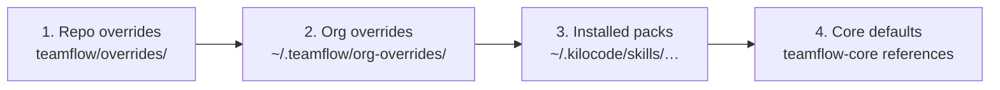

# 07 — Customization

TeamFlow is a standard that teams adapt **without forking packs**. Everything below levels 1–4 is
Markdown and YAML only.

## 1. Resolution order

When a skill needs a template, checklist, spec type, agent definition or reference, it resolves the
**first existing file** in this order (implemented once in `resolve.mjs`, bundled into skills):



Rules:
- The first match wins; there is no merging of Markdown files.
- YAML configuration **is merged** key by key in the reverse order (core defaults ← org policy ← repo
  config), with lists replaced, not concatenated, unless the key is listed as additive (`checklists`,
  `agents.groups`, `specTypes`).
- Invariants ([02 §7](02-architecture.md)) and org `enforced` settings cannot be overridden; a conflicting
  override is ignored and reported by `tf-packs doctor`.
- `resolve.mjs explain <kind> <name>` prints which layer provided each item ("functional-spec template:
  repo override; security checklist: org").

## 2. `teamflow/config.yml`

Schema: `schemas/config.schema.json`. Every key is optional; defaults shown.

```yaml
teamflow: ">=1.0 <2"          # compatible teamflow-core range; mismatch → warning from tf-packs doctor
agent: kilo                    # coding-agent adapter (03)
project:
  name: pricing-service        # default: repository folder name; used in teamflow/docs file names
  team: pricing                # optional; used in telemetry aggregates (phase 3)
  language: en                 # language of generated artifacts (conversation follows the user)
defaultMode: ask               # ask | solo | team
phases:
  architecture: auto           # auto | always | never
  plan: auto                   # auto (tasks.md only when > 1 task) | always
naming:
  topic: "{slug}"
  branch: "feature/{jira}-{slug}"     # {jira} omitted with its dash when no key
  bugBranch: "fix/{jira}-{slug}"
spec:
  requiredSections: [Context, Business rules, Acceptance criteria, Edge cases]
  acceptanceFormat: gherkin    # gherkin | list
  checklists: [security]       # additive
specTypes: {}                  # additive, see §5
review:
  skill: null                  # name of the team's own review skill, or null for the default protocol
agents:
  groups:                      # additive
    pre-pr: [tf-agent-sanity, tf-agent-spec-traceability, tf-agent-sonarqube, tf-agent-checkmarx]
  requiredBeforeShip: [tf-agent-sanity, tf-agent-spec-traceability]
integrations:
  jira:
    enabled: false
    projectKey: null
    issueTypes: { epic: Epic, story: Story, bug: Bug }
  bitbucket:
    enabled: false
    project: null              # Bitbucket DC project key
    repo: null                 # repository slug
    targetBranch: develop
    reviewers: []              # usernames added to every PR
  confluence:
    enabled: false
    space: null
    parentPageId: null
  sonarqube: { projectKey: null }
  checkmarx: { project: null }
phaseSkills: {}                # see §6
```

Server URLs and credentials are **never** in `config.yml`; they live in `~/.config/kilo/teamflow.credentials`
([09](09-atlassian-integrations.md)).

## 3. Templates with generation guidance

`teamflow/overrides/templates/<name>.md` replaces the default template. Each section carries its
generation guidance in a comment the skill reads and removes from the output:

```markdown
## Business rules
<!-- teamflow: one rule per line, numbered BR-01…
     for each rule: trigger, condition, outcome.
     forbidden: technical details (database, API). -->
```

Template names: `functional-spec`, `design`, `tasks`, `bug`, `rebuild`, plus any name referenced by a
custom spec type.

## 4. Checklists

`teamflow/overrides/checklists/<id>.md` — questions grooming MUST cover when the checklist is active
(globally in `spec.checklists` or per spec type).

```markdown
---
id: gdpr
title: Personal data (GDPR)
appliesTo: [feature, api-contract]
---
- Which personal data fields are created, read, updated or deleted?
- What is the legal basis and the retention period?
- How is an erasure request handled for this data?
```

Core ships `security`, `performance`, `data-migration`, `observability`, `rebuild` (used by rebuild mode).

## 5. Custom spec types

```yaml
specTypes:
  api-contract:
    title: API contract change
    files: [functional-spec, design]           # templates to produce
    template: { design: api-contract-design }   # optional template substitution
    checklists: [security, api-versioning]
    requiredSections: [Endpoints, Errors, Compatibility]
    phases: { architecture: always }
    routingHints: ["API contract", "endpoint", "breaking change"]
```

The router uses `routingHints` (rule 8 of the decision table) and `tf-specify` offers the type during
grooming.

## 6. Replacing a phase

```yaml
phaseSkills:
  spec: team-x-spec      # replaces tf-specify for the spec phase
  review: pr-review      # same as review.skill
```

A replacement skill MUST honor the **phase contract**:

| Phase | Reads | Writes | State calls |
|---|---|---|---|
| spec | request, `teamflow/docs`, config | spec files of the type | `init`/`set-phase spec`/`gate spec-approved`/`set-mode` |
| plan | spec files | `tasks.md` | `set-phase plan`, `task add`, `gate plan-approved` |
| implement | spec files, `tasks.md` | code, tests | `set-phase implement`, `task …` incl. TDD fields |
| review | diff, spec files | findings (blocker/should-fix/nit) | `task --reviewed` |
| ship | state, reports | archive, commit, PR | `ship-check`, `archive` |

## 7. Organization layer

The `org-policy` pack installs `~/.teamflow/org-overrides/` (templates, checklists, agents) and an
`org-policy.yml` merged before repo config. Example:

```yaml
sources: ["https://artifactory.example.internal/artifactory/teamflow-packs-release/index.json"]
allowedTrust: [official, org]
enforcedPacks: [teamflow-core, teamflow-agents-security]
enforcedAgents: [tf-agent-checkmarx, tf-agent-secrets]   # cannot be waived; always in requiredBeforeShip
minVersions: { teamflow-core: "1.2.0" }
defaults:
  spec: { checklists: [security] }
telemetry: anonymous      # off | anonymous | on  (phase 3; anonymous = no user identifier)
```

## 8. Versioning of customizations

- `config.yml` declares `teamflow: <range>`. `tf-packs doctor` warns when installed `teamflow-core` is
  outside the range, and lists overrides whose template sections no longer match the core template
  (renamed or removed sections).
- A breaking change in templates or the phase contract requires a major version of `teamflow-core`.
