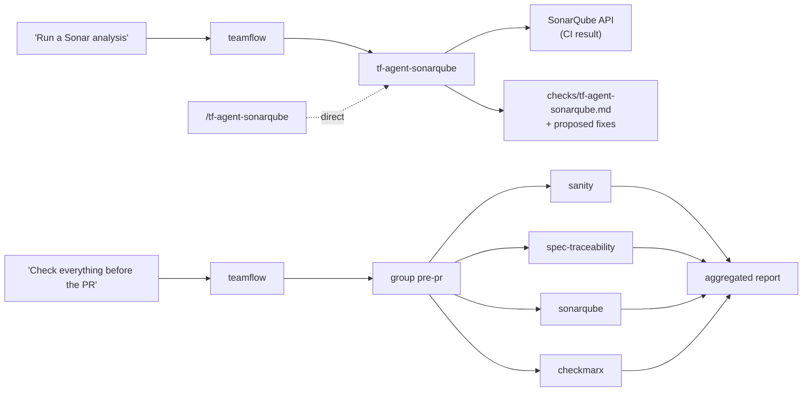

# 08 — Agents and checks

TeamFlow **agents** are on-demand analysis skills (`tf-agent-*`). They are triggered **only** by an
explicit invocation or by the router matching a user request. No workflow runs them automatically;
`tf-archive` only verifies that required ones have run (§6).



## 1. Two families

| | Tool agents | LLM agents |
|---|---|---|
| Examples | `tf-agent-sonarqube`, `tf-agent-checkmarx`, `tf-agent-secrets` | `tf-agent-sanity`, `tf-agent-spec-traceability` |
| Who decides pass/fail | **The tool** (quality gate, severity threshold), through the agent's script | The LLM, following the agent's checklist |
| LLM role | Triage, explain, propose fixes | Perform the analysis |
| Implementation | Script fetches results and writes the report | Skill instructions; runs in an isolated context when available |

## 2. Agent manifest (frontmatter of the agent's `SKILL.md`)

```yaml
---
name: tf-agent-sonarqube
description: >-
  Reads the SonarQube analysis of the current branch or pull request (bugs, vulnerabilities, code
  smells, coverage, quality gate) and proposes fixes. Use when the user asks for a Sonar / code
  quality / coverage / quality gate analysis.
teamflow:
  version: 1
  invocation: auto
  sideEffects: [none]
  agent:
    type: tool                     # tool | llm
    triggers: ["sonar", "code quality", "quality gate", "coverage"]
    needs: [branch]                # branch | pr | topic | diff
    source: ci                     # ci (MVP) | local (post-MVP)
    requires: [sonarqube]          # credential entries in ~/.config/kilo/teamflow.credentials
    readOnly: true
---
```

The router builds its agent catalog from these fields only.

## 3. MVP agents

| Agent | Type | What it does | Pass/fail rule |
|---|---|---|---|
| `tf-agent-sanity` | llm | Fresh-context check: build passes, tests actually pass (re-run), no TODO/debug/commented code added, no file outside the task scope changed, team definition of done met | Any violated item = fail |
| `tf-agent-spec-traceability` | llm | Every change maps to a task/rule in the spec; nothing missing, nothing out of scope | Missing rule or out-of-scope change = fail |
| `tf-agent-sonarqube` | tool | SonarQube Web API: quality gate status and new issues for the branch/PR analysis produced by CI | Quality gate status from SonarQube |
| `tf-agent-checkmarx` | tool | CxSAST (on-premise) results of the latest CI scan for the project and branch | Fail if any finding ≥ configured threshold (default `high`) |
| `tf-agent-secrets` | tool | Scans the diff for secrets (bundled pattern set + entropy) | Any finding = fail |

Authentication uses each developer's **personal read-only token** (SonarQube user token, CxSAST user
credentials/token). SonarQube calls: `api/qualitygates/project_status` and `api/issues/search` for the
branch or pull request. CxSAST REST endpoints are confirmed in WP-10 ([13](13-mvp-plan.md)) against the
organization's server version **(verify)**. If CI has not analyzed the current commit,
the agent reports `warn` with "no analysis for <sha>; latest analyzed: <sha>".

## 4. Groups

Defined in `agents.groups` ([07](07-customization.md)). The router runs every member, in parallel
isolated contexts when the coding agent supports it **(verify for Kilo)**, otherwise sequentially, and
writes an aggregated summary ordered by severity.

## 5. Result handling

1. Each agent writes its report ([06 §5](06-artifacts-and-state.md)) and calls
   `state.mjs record-check` when a topic is active.
2. It shows a short summary, most severe first.
3. It **proposes** fixes ("Fix the 2 blocking issues?"). Tool agents never edit code. Fixes go through
   normal implementation with TDD where applicable.

## 6. Verification at ship time

`ship-check.mjs` (used by `tf-archive`):

| Situation | Result |
|---|---|
| Required agent has a `pass` report for `HEAD` | OK |
| Required agent has no report for `HEAD` | Offer to run it; shipping blocked until it runs |
| Required, non-enforced agent `fail` | Blocked unless a waiver is recorded (`state.mjs waive` with reason) |
| Enforced agent `fail` | Blocked; waivers refused |
| `warn` | Allowed; shown in the PR description |

`requiredBeforeShip` = repo config list ∪ org `enforcedAgents`.

## 7. Adding an agent (team or org)

Create a skill folder with the manifest above. LLM agents: put the checklist in `SKILL.md` or
`references/`. Tool agents: add a script that writes a valid check report (validated against
`schemas/check-report.schema.json`). Distribute it as a pack ([10](10-marketplace-and-packs.md)). No
change to the router or other skills is needed.
