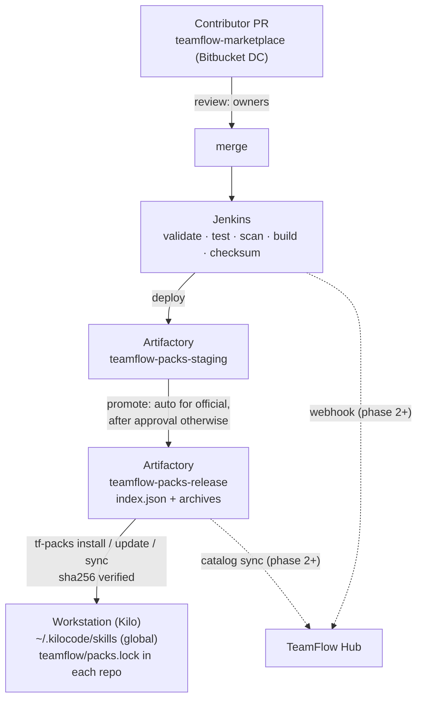

# 10 — Marketplace and packs

Visual version: [diagrams/marketplace.html](diagrams/marketplace.html).

Everything TeamFlow can do arrives on a workstation as a **pack**. The marketplace is a source
repository on **Bitbucket Data Center**, a **Jenkins** pipeline, and two **Artifactory** generic
repositories. No custom server is needed in the MVP.



## 1. Pack format

An archive `<id>-<version>.tgz` containing:

```
<id>/
├── teamflow-pack.yml
├── README.md
├── CHANGELOG.md
├── skills/<skill-name>/{SKILL.md, references/, scripts/}
└── overrides/            # only for org-policy-like packs: templates, checklists, agents
```

### 1.1 Manifest `teamflow-pack.yml` (schema `schemas/pack.schema.json`)

```yaml
id: teamflow-agents-quality         # ^[a-z][a-z0-9-]{2,63}$, unique
version: 1.3.0                      # semver; major = breaking change
title: Quality agents
description: Sanity, spec traceability and SonarQube agents.
owner: platform-team                # Bitbucket group or team id
trust: official                     # official | org | community
teamflow: ">=1.0 <2"                # compatible teamflow-core range
provides:
  skills: [tf-agent-sanity, tf-agent-spec-traceability, tf-agent-sonarqube]
  agentGroups: { quality: [tf-agent-sanity, tf-agent-sonarqube] }
  checklists: []
  templates: []
  specTypes: []
requires:
  packs: { teamflow-core: ">=1.0" }
  credentials: [sonarqube]
executesCode: true                  # true if any skill contains scripts
sideEffects: [none]                 # union of skills' sideEffects
deprecated: null                    # or { reason, replacement }
```

## 2. Source repository `teamflow-marketplace`

Layout in [02 §6](02-architecture.md). Contribution rules:

- Every pack folder has owners. Use Bitbucket DC's native code owners / default reviewers per path if the
  server version supports them; otherwise an `OWNERS.yml` file at the repository root and a Jenkins stage
  that blocks the merge until an owner of every changed pack has approved (Bitbucket REST API).
- Changes to any `SKILL.md` or `references/` require approval from the pack owners **and** the
  platform team (prompt changes can alter agent behavior).
- `community/` packs: no `scripts/` unless an exception is approved (then they move to `org` trust).
- Version bumps are explicit in the manifest; CI refuses a changed pack without a version bump and a
  CHANGELOG entry.

## 3. Jenkins pipeline (`Jenkinsfile`)

| Stage | Runs on | Content | Fails when |
|---|---|---|---|
| Checkout | PR + main | — | — |
| Detect changed packs | PR + main | Diff against target branch | — |
| Validate | PR + main | Manifest schema, id uniqueness, semver bump, CHANGELOG entry, `provides` matches folders, skill frontmatter valid, canonical skill rules ([03](03-agent-adapters.md)) | Any violation |
| Typecheck + unit tests | PR + main | `tsc --noEmit`, `node --test` for `src/` and pack scripts | Any failure |
| Evals (core only) | PR + main | Routing scenarios on recorded fixtures (deterministic subset) | Below threshold |
| SonarQube | PR + main | Scan `src/` and scripts | Quality gate fails |
| Checkmarx | PR + main | SAST on `src/` and scripts | ≥ high finding |
| Secrets scan | PR + main | All files | Any finding |
| Build | main | Bundle scripts, copy shared references, create `<id>-<version>.tgz`, compute SHA-256 | — |
| Publish to staging | main | `PUT` to `teamflow-packs-staging/<id>/<version>/`, set Artifactory properties (`teamflow.trust`, `teamflow.compat`, `teamflow.owner`, `sha256`) | Version already exists |
| Promote | main | `official`: automatic copy to `teamflow-packs-release`. `org`/`community`: wait for approval (Jenkins input step in MVP; Hub button in phase 4) | Rejected |
| Index | after promote | Regenerate `index.json` in release from release contents | — |
| Notify | after index | Webhook to Hub (phase 2+); chat/email notification | — |

Releases are immutable: a published `<id>/<version>` is never overwritten; withdrawal = set
`teamflow.yanked=true` property and regenerate the index.

## 4. Artifactory

| Repository | Type | Content | Who can read |
|---|---|---|---|
| `teamflow-packs-staging` | generic, local | Candidate archives | Platform team, Jenkins |
| `teamflow-packs-release` | generic, local | Promoted archives + `index.json` + bootstrap installer | All developers — anonymous read on the internal network; per-user token only as a fallback |

### 4.1 `index.json` (schema `schemas/index.schema.json`)

```json
{
  "schema": 1,
  "generatedAt": "2026-10-01T10:00:00Z",
  "packs": [
    {
      "id": "teamflow-agents-quality",
      "title": "Quality agents",
      "description": "Sanity, spec traceability and SonarQube agents.",
      "owner": "platform-team",
      "trust": "official",
      "versions": [
        {
          "version": "1.3.0",
          "teamflow": ">=1.0 <2",
          "url": "teamflow-agents-quality/1.3.0/teamflow-agents-quality-1.3.0.tgz",
          "sha256": "9f2c…",
          "publishedAt": "2026-09-30T15:12:00Z",
          "executesCode": true,
          "sideEffects": ["none"],
          "requires": { "packs": { "teamflow-core": ">=1.0" }, "credentials": ["sonarqube"] },
          "yanked": false,
          "deprecated": null
        }
      ]
    }
  ]
}
```

## 5. Lockfile `teamflow/packs.lock` (committed)

```yaml
schema: 1
agent: kilo
packs:
  teamflow-core:           { version: 1.2.0, sha256: "…" }
  teamflow-jira:           { version: 1.0.3, sha256: "…" }
  teamflow-agents-quality: { version: 1.3.0, sha256: "…" }
```

- All packs are installed **globally** (one version per workstation). The lockfile declares the versions
  the repository requires.
- `sync` installs missing packs at the locked version. When the globally installed version differs from
  the lock (another repository needed another version), `sync` reports the difference and 🛑 offers to
  switch the global installation to the locked version; it never installs two versions side by side.
- The router warns at the start of a topic when installed versions do not match the lockfile.

## 6. `tf-packs` behavior

| Command | Behavior | Acceptance |
|---|---|---|
| `list` / `search` / `info` | Read cached `index.json` (refresh if older than 1 h or `--refresh`) | Works offline from cache with a staleness note |
| `install <id>[@range]` | Resolve version (highest non-yanked matching range and `teamflow` compat) and dependencies → check org policy (sources, trust, min versions) → show summary (executesCode, sideEffects, credentials) → 🛑 confirm → download to cache → verify SHA-256 → install via adapter → update lockfile → report missing credentials | A checksum mismatch aborts with no file installed |
| `update [<id>]` | Show available versions and CHANGELOG excerpts; majors require explicit confirmation | Lockfile updated only after successful install |
| `remove <id>` | Refused for enforced packs and for packs required by others | — |
| `sync` | Install exactly the lockfile; then enforced packs missing from it are added | Idempotent: second run does nothing |
| `doctor [--setup]` | Policy compliance, adapter files present, rule installed, credentials present per installed pack, config range, override drift ([07](07-customization.md) §8); `--setup` writes missing credential entries interactively | Exit ≠ 0 when non-compliant |

Installation is atomic per pack: extract to a temporary folder, then rename into place; on failure the
previous version stays.

## 7. Bootstrap (first install on a machine)

`install-teamflow.mjs` is published in `teamflow-packs-release/bootstrap/`. Users run one command:

```bash
# Linux / macOS
curl -fsSL https://artifactory.example.internal/artifactory/teamflow-packs-release/bootstrap/install-teamflow.mjs -o /tmp/install-teamflow.mjs && node /tmp/install-teamflow.mjs
```

```powershell
# Windows
Invoke-WebRequest https://artifactory.example.internal/artifactory/teamflow-packs-release/bootstrap/install-teamflow.mjs -OutFile $env:TEMP\install-teamflow.mjs; node $env:TEMP\install-teamflow.mjs
```

It: checks Node ≥ 20 → detects Kilo → downloads and verifies `org-policy` and `teamflow-core` → installs
them globally → registers the routing rule in Kilo's global configuration and installs the `chat.message`
plugin → 🛑 offers to add the TeamFlow scripts to Kilo's auto-approved commands (external writes are still
confirmed by the skills) → creates `~/.teamflow/` and the credentials file `~/.config/kilo/teamflow.credentials`
(user-only permissions) via interactive prompts (skippable) → prints next steps ("open a repository and
say: set up TeamFlow here"). Re-running it upgrades and repairs.

Repository setup ("set up TeamFlow here") is done by the router + `tf-packs`: create `teamflow/config.yml`
from questions (Jira project, Bitbucket repo, Confluence space), create `packs.lock`.

## 8. Trust levels

| Level | Publisher | Scripts allowed | Review | Promotion |
|---|---|---|---|---|
| `official` | Platform team | Yes | Platform owners | Automatic |
| `org` | Teams, sponsored by platform | Yes, after Sonar/Checkmarx/secrets pass | Platform + pack owners | Manual approval |
| `community` | Any team | No (exception → becomes `org`) | Pack owners | Manual approval |

Org policy `allowedTrust` decides what `tf-packs` may install.

## 9. Security

- Packs run code on developer machines: treat the marketplace as a software supply chain (reviews, SAST,
  secrets scanning, immutable releases, checksums verified on install).
- Prompt content (`SKILL.md`, references) is reviewed for instructions that could exfiltrate data, run
  unexpected commands or bypass gates.
- No credentials in packs. Scripts read credentials only from `~/.config/kilo/teamflow.credentials` / env vars.
- Post-MVP: signed archives (e.g. a signing key held by Jenkins, public key shipped in `org-policy`).
