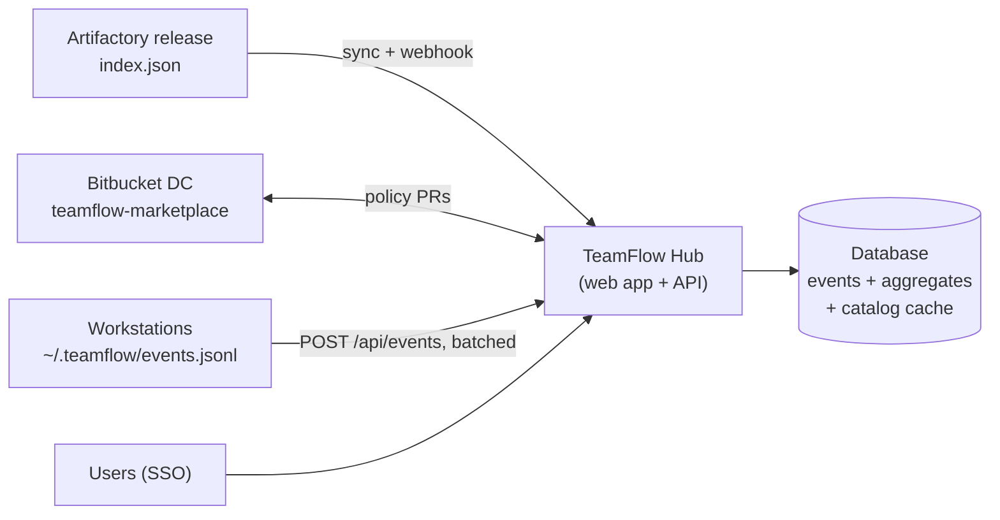

# 11 — TeamFlow Hub and telemetry (phases 2–4, not in MVP)

The MVP MUST work without anything in this file. This specification exists so that MVP decisions
(event-friendly scripts, index format, manifest fields) do not block later phases.

## 1. Principle

The Hub is **never a source of truth**. Packs live in Bitbucket DC and Artifactory; policy lives in the
`org-policy` pack. The Hub reads, aggregates and displays; when it acts, it **triggers an Artifactory
promotion** or **opens a Bitbucket pull request**. If the Hub is down, developers keep installing and
working.



## 2. Screens

| Phase | Screen | Content |
|---|---|---|
| 2 | Catalog | Search and filters (type, trust, owner), pack page: README, versions, CHANGELOG, required credentials, executesCode/sideEffects, install command to copy |
| 2 | Getting started | Bootstrap commands, links to the beginner guide |
| 3 | Adoption | Installs per pack and version, active repositories, teams, trend over time |
| 3 | Fleet health | Outdated or yanked versions in use, missing enforced packs, `teamflow-core` versions in circulation |
| 3 | Usage | Most used skills and agents, journeys started vs completed, phase where topics stall |
| 3 | Quality | Check pass rates at ship time, waivers granted (who, why) |
| 4 | Governance | Approve `org`/`community` packs (promotion), deprecate/yank versions, propose `org-policy` changes (opens a PR) |

## 3. API (phase 2–4)

| Method | Path | Phase | Purpose |
|---|---|---|---|
| GET | `/api/packs` | 2 | Catalog (from cached index) |
| GET | `/api/packs/{id}` | 2 | Pack details, versions, README |
| POST | `/api/webhooks/pack-published` | 2 | Jenkins notification → refresh cache |
| POST | `/api/events` | 3 | Batched telemetry events (≤ 500 per request) |
| GET | `/api/stats/{adoption\|health\|usage\|quality}` | 3 | Aggregates for screens |
| POST | `/api/packs/{id}/versions/{v}/promote` | 4 | Calls Artifactory copy staging → release, then regenerates the index (through Jenkins job) |
| POST | `/api/packs/{id}/versions/{v}/yank` | 4 | Sets `teamflow.yanked` property, regenerates index |
| POST | `/api/policy/proposals` | 4 | Opens a Bitbucket PR on `org-policy` |

Authentication: company SSO (OIDC or SAML — **to confirm**). `/api/events` accepts a per-machine token
issued at bootstrap, or anonymous posts on the internal network depending on policy. Governance
endpoints require membership of the platform AD group.

## 4. Telemetry events

Events come **only from scripts** (prompts cannot guarantee emission):

| Source | Event types |
|---|---|
| `tf-packs` | `pack.installed`, `pack.updated`, `pack.removed`, `packs.synced`, `doctor.failed` |
| `state.mjs` | `topic.created`, `phase.changed`, `gate.recorded`, `mode.set`, `task.done`, `check.recorded`, `waiver.recorded`, `topic.archived` |
| Kilo plugin | `skill.invoked`, `router.routed` **(verify)** |

```json
{
  "schema": 1,
  "type": "phase.changed",
  "ts": "2026-10-01T09:12:00Z",
  "teamflow": "1.2.0",
  "pack": "teamflow-core",
  "packVersion": "1.2.0",
  "agent": "kilo",
  "repo": "h:5f1c…",
  "team": "pricing",
  "user": "h:a91e…",
  "data": { "from": "spec", "to": "plan", "mode": "solo", "topicType": "feature" }
}
```

Rules:
- **No content**: never code, prompts, spec text, file paths or topic titles. Only identifiers of packs,
  skills, phases, statuses and counts.
- `repo` and `user` are salted SHA-256 hashes (salt distributed in `org-policy`); `team` is in clear
  (from `config.yml` `project.team`, optional).
- Events are appended to `~/.teamflow/events.jsonl` and sent in the background by the next script run;
  sending never blocks or slows a user action; failures are retried later; the file is capped (10 MB).
- Controlled by org policy `telemetry: off | anonymous | on` (`anonymous` drops `user`). Default
  **`anonymous`** from the start of phase 3, subject to the DPO's agreement (GDPR).

## 5. Stack

| Concern | Status | Choice |
|---|---|---|
| Backend | Decided | ASP.NET Core Web API |
| Frontend | Decided | Single-page application calling the API (framework to choose at the start of phase 2) |
| CI | Decided | Jenkins |
| Hosting | Phase 2 | Candidate: OpenShift, image in Artifactory's Docker registry, deployment via XL Deploy / XL Release |
| Database | Phase 2 | Organization standard (SQL Server or PostgreSQL) |
| SSO | Phase 2 | OIDC or SAML via the corporate identity provider |

## 6. Data model (outline)

- `PackVersionCache(packId, version, trust, owner, compat, sha256, publishedAt, yanked, deprecated, readme)`
- `Event(id, type, ts, teamflowVersion, packId, packVersion, agent, repoHash, team, userHash, data JSON)`
- Daily aggregates: `InstallsDaily`, `ActiveReposDaily`, `PhaseTransitionsDaily`, `CheckResultsDaily`.
- Retention: raw events 90 days, aggregates 2 years (to confirm with the DPO).
