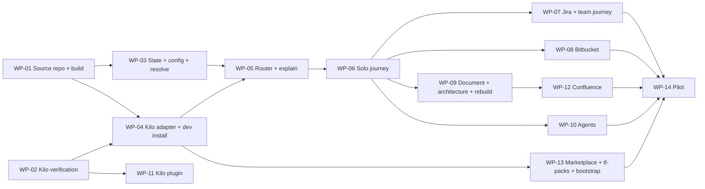

# 13 — MVP plan

Work packages (WP) are ordered by dependency. Each has a definition of done (DoD). A WP is done only
when its tests pass in Jenkins and its DoD is demonstrated.

| WP | Content | Depends on | Definition of done |
|---|---|---|---|
| **WP-01** Source repository and build | Create `teamflow-marketplace` on Bitbucket DC with the layout of [02 §6](02-architecture.md); port reusable code ([12](12-reusable-code.md)); build: one bundle per script, shared-reference copy, pack archive + SHA-256; JSON Schemas for pack, config, state, check report, index, lockfile; Jenkinsfile with validate/test stages | — | `npm test` green in Jenkins; `node tools/build.mjs` produces archives for every pack; schemas validated by tests |
| **WP-02** Kilo verification spike | Confirm every **(verify)** item about Kilo in [03](03-agent-adapters.md) and [02](02-architecture.md): skill folders (user/project), frontmatter fields, explicit-only invocation, rule registration, `chat.message` plugin behavior and context injection, sub-agent isolation, script execution and approvals, Windows behavior | — | A short report appended to [14](14-decisions-and-open-questions.md) resolving each item; a throwaway skill with a script runs in Kilo on Windows and Linux |
| **WP-03** State, config, resolution | `state.mjs` (all commands of [06 §3](06-artifacts-and-state.md)), config loading and merge ([07](07-customization.md)), `resolve.mjs` with `explain`, `validate-spec.mjs` | WP-01 | Unit tests for every transition rule and refusal; resolution tests for all 4 layers; atomic writes tested |
| **WP-04** Kilo adapter + dev install | Adapter per [03](03-agent-adapters.md); `tools/dev-install.mjs` installs packs from the local build into Kilo (no Artifactory) | WP-01, WP-02 | Golden-file tests; the core skills appear in Kilo and can be invoked |
| **WP-05** Router + explain | `teamflow` skill with routing table and roles; `tf-explain`; routing evals (§2) | WP-03, WP-04 | ≥ 90 % routing scenarios pass; `tf-explain` writes no file |
| **WP-06** Solo journey | Starts with a review, with the product owner, of the existing internal skills each TeamFlow skill replaces (content shared by the product owner, not stored in this repository); then `tf-specify` (feature, bug), `tf-planify --local`, `tf-implement`, `tf-review`, `tf-archive` (without Bitbucket PR: local commit only until WP-08), `tf-forge`; shared method references and default templates/checklists | WP-05 | Scenario "solo feature" and "bug fix" executed end to end on the sample repository with all gates and TDD records in `state.md`; resume in a new session works |
| **WP-07** Jira + team journey | `tf-jira` (sync, pull, transition, show, doctor) with DC Epic fields and the MUST fixes; team branch of `tf-specify`/`tf-planify`; `tf-implement <KEY>` | WP-06 | Fake-server tests incl. failure mid-run; manual test against the organization's Jira DC test project; BA→Dev handoff on two machines |
| **WP-08** Bitbucket | `tf-bitbucket` (branch, pr, pr-status, doctor); `tf-archive` opens/updates PRs | WP-06 | Fake-server tests; PR created on the Bitbucket DC test repository; re-run updates instead of duplicating |
| **WP-09** Document, architecture, rebuild | `tf-document` (full, scope, rebuild, import), `tf-architecture`, rebuild journey with child topics | WP-06 | Documentation of the sample repository cites sources for every section; rebuild scenario creates lots as child topics |
| **WP-10** Agents | Agent manifest support in router; `tf-agent-sanity`, `-spec-traceability`, `-sonarqube` (CI), `-checkmarx` (CI), `-secrets`; groups; `ship-check.mjs`; waivers | WP-06 | Report schema validation tests; API contract tests against fakes; manual run against the organization's SonarQube and Checkmarx |
| **WP-11** Kilo plugin | `chat.message` plugin (MVP scope) using the mechanism confirmed by WP-02: pattern detection (Jira key, agent keywords, active topic, lockfile mismatch) and context note; < 50 ms; installed globally by the bootstrap | WP-02 | Routing evals improve or stay equal; latency measured on Windows and Linux |
| **WP-12** Confluence | `tf-confluence` (publish, status, doctor), Markdown → storage converter | WP-09 | Converter unit tests; publish/update/conflict detection on the Confluence DC test space |
| **WP-13** Marketplace + `tf-packs` + bootstrap | Artifactory repositories, Jenkins publish/promote/index stages, `tf-packs` (all commands), lockfile, `org-policy` pack, bootstrap installer (Windows + Linux) | WP-01, WP-04 | A merged change appears in release and is installed by `tf-packs update`; checksum tampering test; bootstrap on clean Windows and Linux VMs in < 10 min |
| **WP-14** Pilot | One volunteer team, one real repository, two weeks | all | Success criteria S1–S7 of [00](00-vision-and-scope.md) measured and reported |

## 2. Test strategy

| Level | What | How |
|---|---|---|
| Unit | Scripts (state, config, resolve, jira, bitbucket, confluence, agents, packs, adapter) | `node --test`, fake HTTP servers, temp directories; run in Jenkins on every PR |
| Schema | All YAML/JSON artifacts | JSON Schemas in `schemas/`; fixtures valid/invalid |
| Golden files | Adapter output, pack build output | Snapshot comparison |
| Routing evals | Router decisions | `evals/routing/*.yml`: `{ prompt, repoFixture, activeTopics, installedPacks, expect: { skill \| question } }`; run manually against Kilo for the full set; a deterministic subset (decision table logic exercised through recorded transcripts) runs in CI |
| Skill scenarios | End-to-end journeys | `evals/scenarios/*.md` scripts executed by a person in Kilo on `evals/fixtures/sample-repo` (a small .NET or Node service with known features and a known bug); checklist of expected files, gates and state entries |
| Integration | Real servers | Manual checklist per release against Jira/Bitbucket/Confluence DC test projects, SonarQube, Checkmarx, Artifactory |

Minimum routing scenario set (MUST exist before WP-05 is done): at least 3 prompts for each row of the
router decision table in [02 §3.1](02-architecture.md), in English and French, including ambiguous ones.

## 3. Release

- Version all packs `1.0.0` at the end of the MVP; `teamflow-core` minor releases every two weeks during
  the pilot.
- Each release: CHANGELOG, integration checklist completed, routing evals ≥ 90 %.
